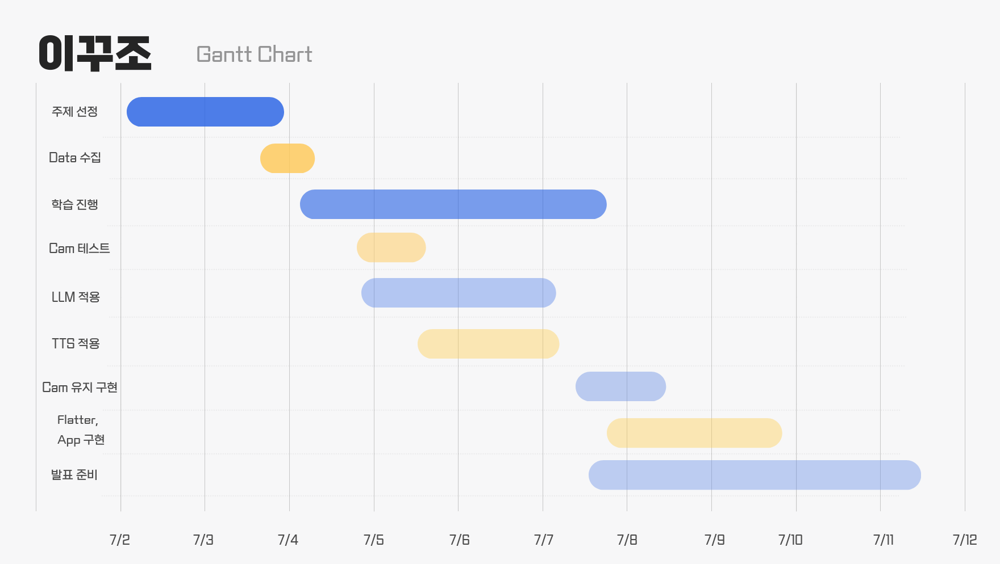

# Gantt Chart

# Daily Report

## 07/02

AI 기반 기술을 통한 프로젝트 시작.

주제를 선정하기 위해 토론한 결과 다음과 같은 결과 생성하고 주제에 대한 Datastack 조사

>머리카락 두께 및 탈모 초기 진단 + 맞춤형 예방 관리 가이드  
https://www.notion.so/22437ce5f9f080f2986fdd7b4e617a72  
https://www.notion.so/22437ce5f9f080f2986fdd7b4e617a72?pvs=21

>수어 인식(SLR)  
https://www.notion.so/SLR-USECASE-22437ce5f9f08012a20fc74d676e1f17
https://www.notion.so/SLR-USECASE-22437ce5f9f08012a20fc74d676e1f17?pvs=21

>Raspberry Pi 5 기반 개인 맞춤형 AI 의류 코디 추천 시스템 예비 보고서  
https://www.notion.so/22437ce5f9f0806fb7e5fd59456d8c54
https://www.notion.so/22437ce5f9f0806fb7e5fd59456d8c54?pvs=21

공익 목적에 대한 좋은 주제로 판단하여 수어 인식 프로젝트로 진행하고자 결정.

## 07/03

동적 데이터를 학습시키기엔 제한된 환경이 존재해서 수화를 통한 텍스트 추출 주제를 선정하지 못한다 판단.  
→ 구글 코랩 및 라즈베리 파이에서 영상을 기준으로 학습하기에 용량 및 성능 제한과 이를 학습시킬 그래픽카드 부재.

따라서 기존에 사용하고자 결정했던 카메라를 통한 가마 측정 및 근접 촬영을 통한 두피상태 진단 솔루션을 진행.

추가 의견인 피부 트러블 분류에 대한 의견이 나옴.

토의를 진행한 결과, 피부에 관련한 사람들의 많은 관심과 폭 넓은 이용 수가 있을 것이라 판단하였고 더 흥미롭고 조원들이 관심 있는 주제이기 때문에 결정.

12:00  
피부 솔루션으로 최종 주제가 결정 났으며, 해당 프로젝트를 구현 후 종합 솔루션을 구현하기 위하여 탈모진단 기능까지 확대하고자 기획을 완료.

12:30  
데이터 셋을 다운받아 Google Drive에 올려 공유하며 DataSet을 분류.

13:00 → 14:00  
점심식사 진행하며 진행 방향성에 대해 토론 시작. 

14:00 ~  
모델 학습 진행.

## 07/04

피부 트러블에 대한 학습을 진행

09:00 ~  
학습률은 괜찮게 나왔지만 실제 객체를 인식하는데에 한계가 있음.  
( 카메라 화질의 문제 및 구분하기 어려울 정도의 비슷한 병변의 존재 )

또한 제한된 용량으로 인해 ( 코랩 용량 ) 진행하기 어려.

따라서 기존 15개의 class를 6~7개 정도로 줄임.  
→ 캠으로 체크가 가능하며 조기 진단 밎 치료가 가능한 상태의 피부병

14:00 ~  
그 결과 val_acc가 97%정도로 학습 완료되었고, 카메라로 실제 확인한 시연결과 각 클래스들을 잘 인지하는 것을 확인.

따라서 같은 방식으로 더 좋은 인지를 위해 하이퍼파라미터 변경으로 더 나은 성능을 찾고자 진행하며 Gemma 학습을 통한 처방 과정학습을 시작.

추가적으로 전체적인 프로젝트 Flow를 정함.

## 07/05

토요일( 주말 )을 활용하여 프로젝트 진행

Google Colab에서 학습한  h5 모델을 라즈베리 파이로 옮겨, Python 코드로 실행하며 실시간 카메라를 통해 추론을 수행.

3초 이상 해당 Class 인식이 시작되었을 때 LLM( Gemma3:1b )을 이용헤 미리 학습시킨 Class에 관한 처치 방법을 제공.

전반적인 프로젝트 완성.

따라서 앞으로는 더 많은 Class에 대한 h5 학습 모델로 확장시키고 더 많은 정보를 제공하는 것을 목표로 진행.

## 07/07

Converter를 이용한 양자화를 진행하여 메모리 정렬 및 사이즈 최적화.  
→ .h5 to .onnx

또한 TTS를 삽입하여 음성을 통한 진단을 읽어주는 시스템을 구축.

Interface를 만들어 APP 형식으로 사용자에게 서비스 제공하는 것을 목표로 진행.

## 07/08

## 07/09