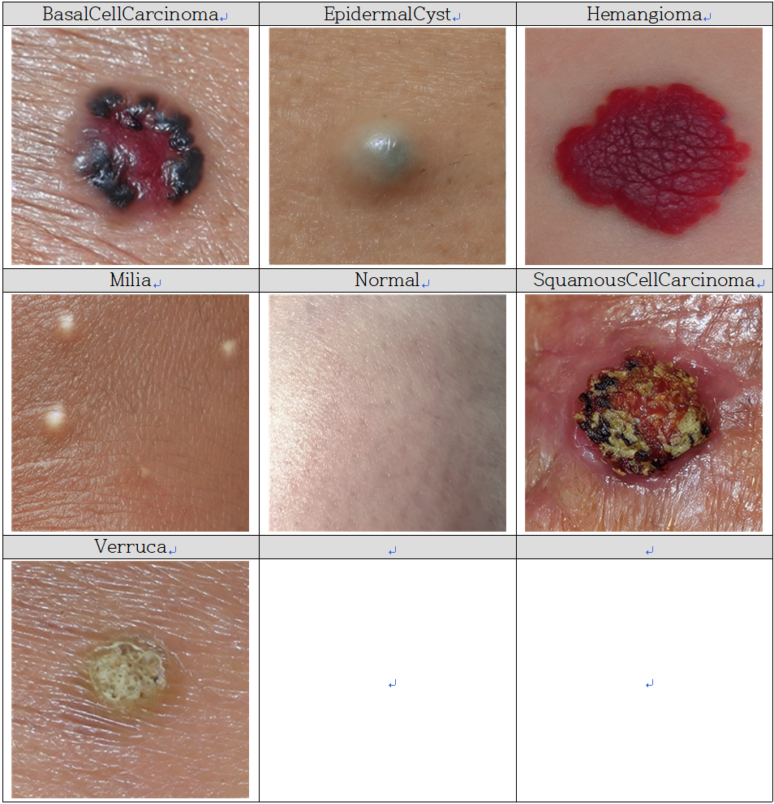

# Dataset
---

|영어 명칭|한국어 명칭|설명|중증도/위험성|Dataset|
|:---:|:---:|:---:|:---:|:---:|
|Actinic Keratosis|광선 각화증|자외선 노출로 인한 전암성 병변|⚠️ 중등도 (암으로 진행 가능성 있음)|X|
|Basal Cell Carcinoma|기저세포암|가장 흔한 피부암, 천천히 자람|⚠️ 중등도~고위험 (재발 가능성 높음)|index 0|
|Bowens Disease|보웬병 (상피내암)|피부의 국소적인 편평세포암 전단계|⚠️ 중등도 (암으로 진행 가능)|X|
|Dermatofibroma|피부섬유종|양성 결절, 피부에 단단한 혹	|✅ 낮음 (미용 외 문제 거의 없음)|X|
|Epidermal Cyst|표피낭종|피지나 각질이 차는 낭종|✅ 낮음 (염증 시 치료 필요)|index 1|
|Hemangioma|혈관종|혈관이 뭉쳐 생긴 양성 종양|✅ 낮음 (유아기 후 자연 소실 가능)|index 2|
|Malignant Melanoma|흑색종|가장 치명적인 피부암|🔴 매우 높음 (빠른 전이 가능)|X|
|Melanocytic Nevus|멜라닌세포 모반 (점)|일반적인 점, 양성 병변|✅ 낮음 (변형 시 검사 필요)|X|
|Milia|비립종|작고 하얀 좁쌀 여드름|✅ 낮음 (미용 목적 제거 가능)|index 3|
|Pigmented Macule|색소반|기미, 주근깨 등 색소 증가 부위|✅ 낮음 (미용적 문제)|X|
|Pyogenic Granuloma|화농성 육아종|빠르게 자라는 혈관성 결절|⚠️ 중등도 (출혈, 재발 우려 있음)|X|
|Sebaceous Hyperplasia|피지샘 증식|피지샘의 과도한 증식|✅ 낮음 (미용 외 문제 없음)|X|
|Seborrheic Keratosis|지루각화증|나이 들면서 생기는 양성 종양	|✅ 낮음 (암과 유사해 보일 수 있음)|X|
|Squamous Cell Carcinoma|편평세포암|피부암 중 하나로 전이 가능|🔴 높음 (초기 치료 중요)|index 5|
|Verruca|사마귀|HPV 감염으로 발생|⚠️ 중등도 (전염 가능성 있음)	|index 6|
|Normal|정상피부|-|-|index 4|
