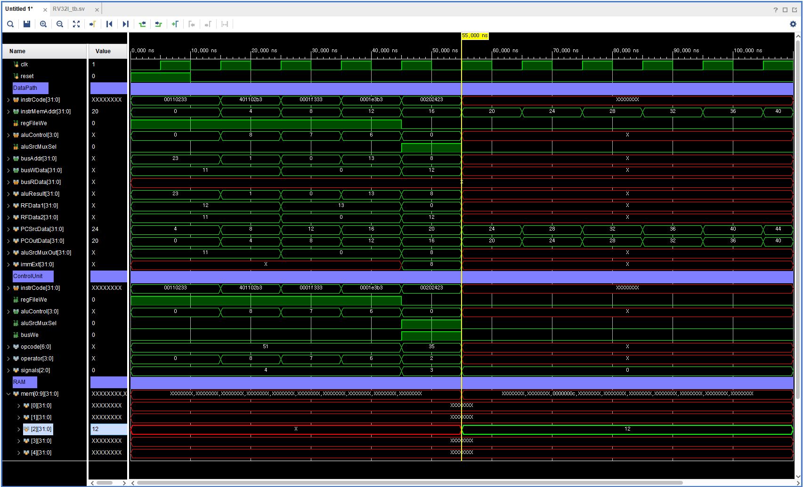
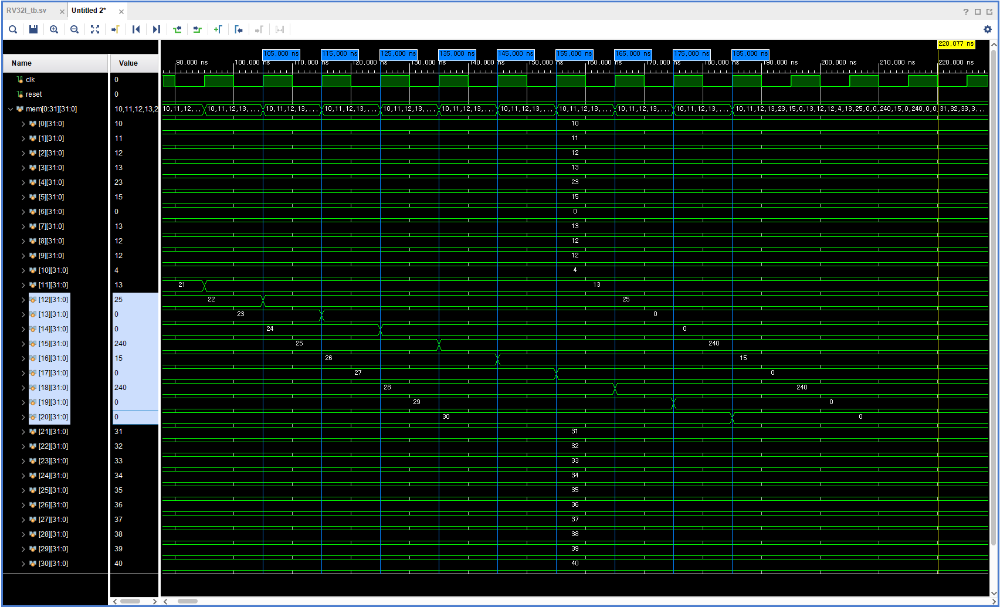

# 이론
---
## R-Type
 

최근 MCU는 ROM 대신 Flash Memory 사용.

    Mask ROM은 제조시 프로그램을 하드코딩 
    -> 한번 제작하면 수정 불가능

    Flash Memory는 전기적으로 지우고 다시 쓸 수 있음 
    -> 펌웨어 업데이트나 버그 수정이 가능

## S-Type
 

S-Type의 특징
        
    RAM이 존재
    
    Random Access Memory <-> Sequential Access Memory

    메모리의 어느 주소에든 동일한 시간에 접근할 수 있음

## L-Type
 

## I-Type

# 과제 & 코드
---

## S-Type
 

## I-Type
 