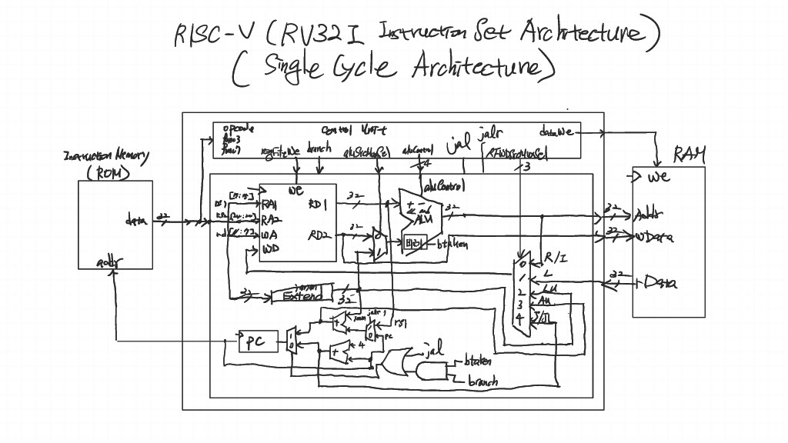
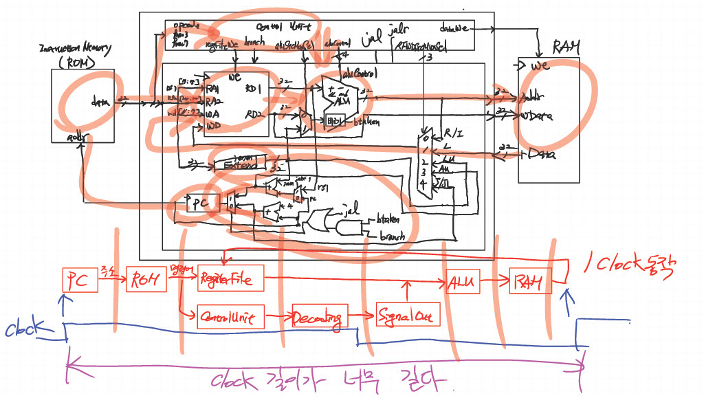
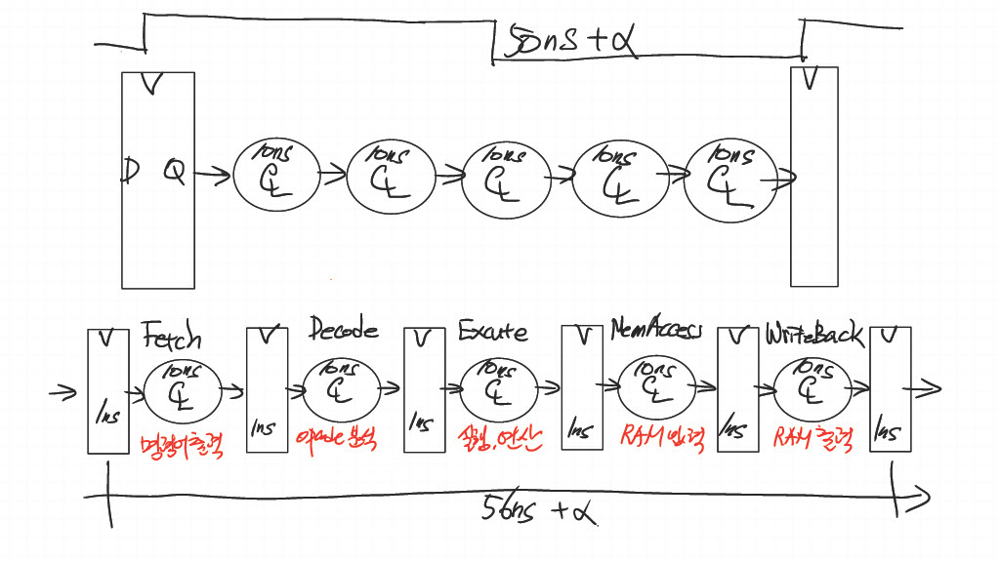
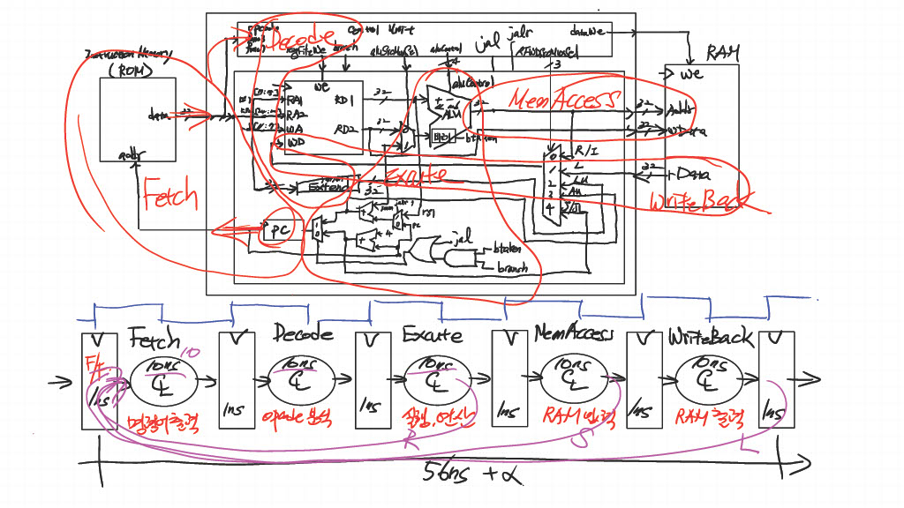
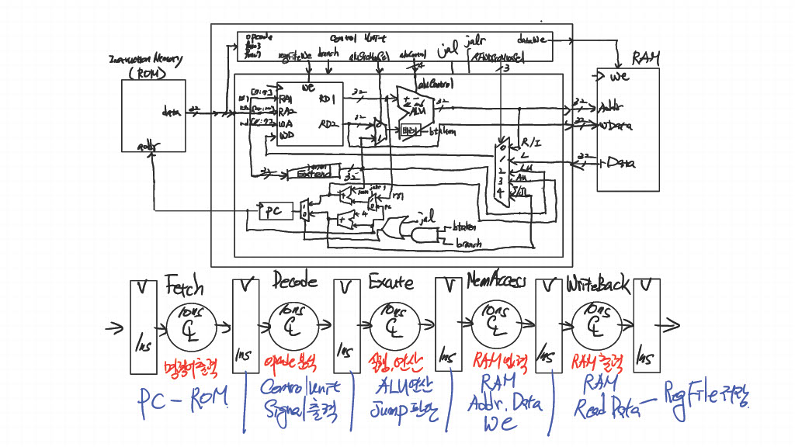
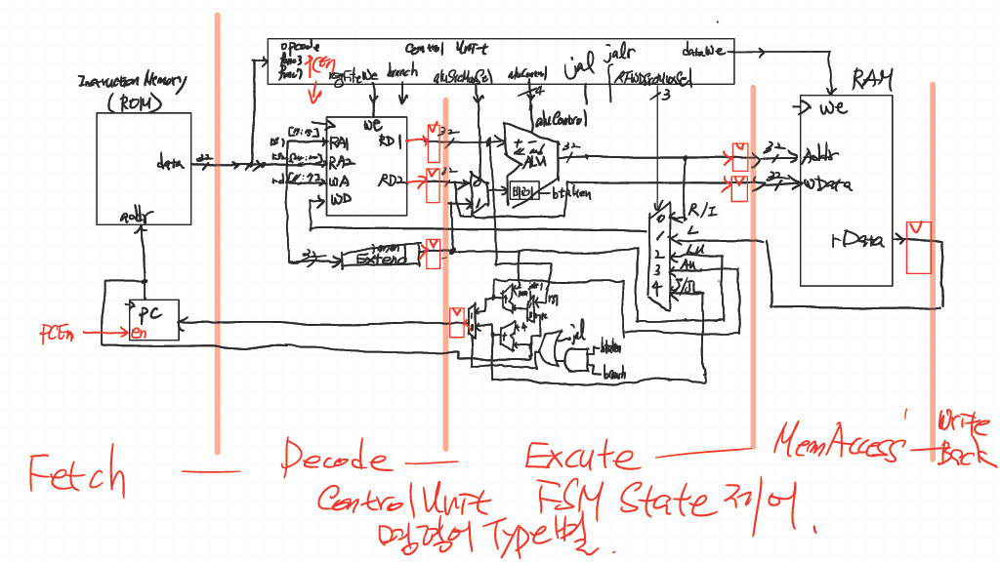
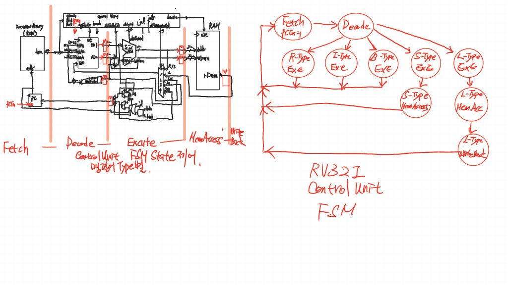

# 이론
---

 

 

 

 

 

 

## Single Cycle
    
    가장 긴 Path를 가진 Type : L-Type (RAM을 거치기 때문에)

    Path가 짧은 R-Type 같은 것들도 다 L-Type의 Clock에 맞춰서 동작을 하게 됨
    -> 비효율적

## Multi Cycle

    중간 중간 쪼개서 각각 한 Clock에 동작하게 만듦
    -> Type 마다 서로 다른 Clock에 동작하게 만들 수 있음

# 과제 & 코드
---
