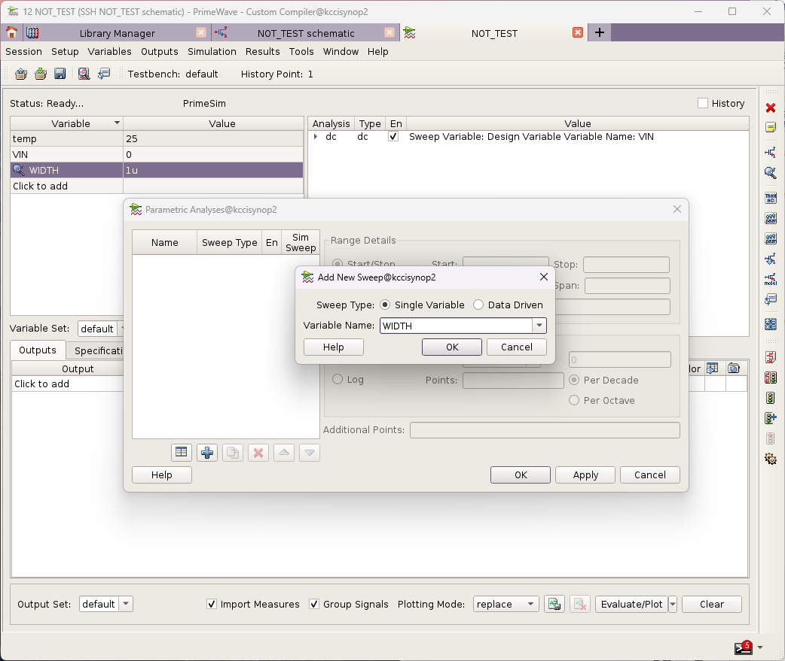
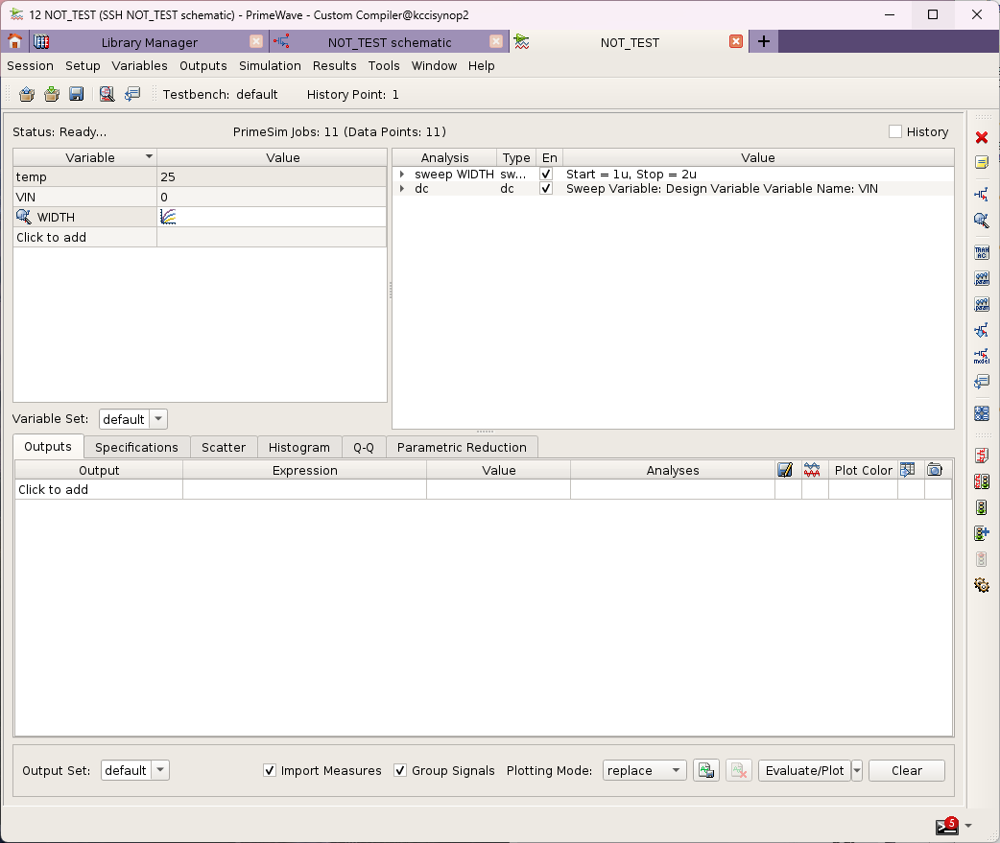
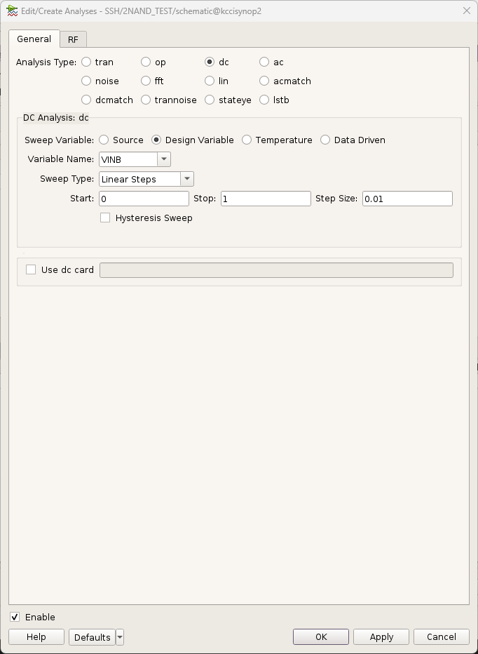

# Sweep
---
 
 
 
 
 
 
 **pmos width sweep 세팅**

# Simulation
---

 **pmos width sweep 결과**

# Custom Compiler
---

# Schematic
---
 **nmos width = 0.5u 설정**

# Symbol
---
 
 

# Testbench
---

# Simulation
---
 **VINB 세팅**
 **pmos width = 0.5u ~ 1.5u / stepsize = 0.1u 세팅**
 
 **Simulation 결과**

 **pmos width = 0.85u ~ 0.95u / stepsize = 0.01u 세팅**
 **Simulation 결과**