# Code
---
**데이터 정보**
>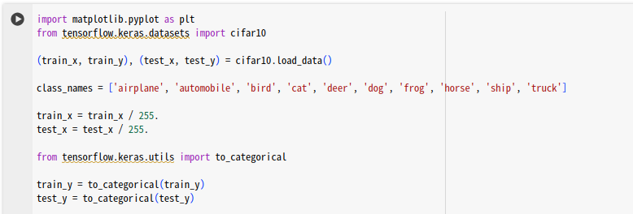

 

**CNN 모델 디자인**
>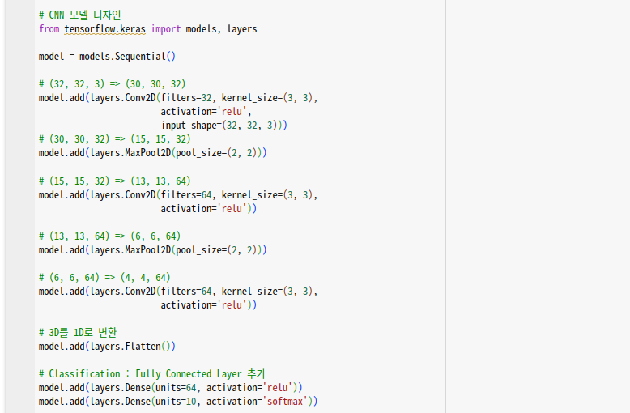

 

**모델 학습 정보 설정 및 학습**
>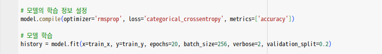

 

**그래프 설정**
>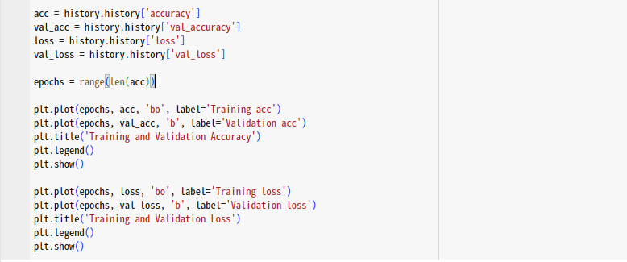

 

**데이터 수 확인**
>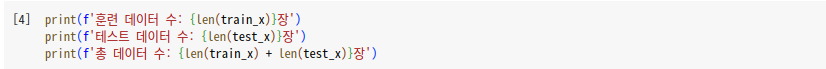
>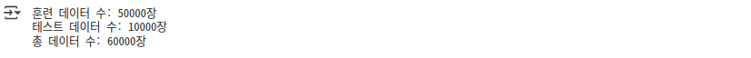

 

**분류 결과 확인**
>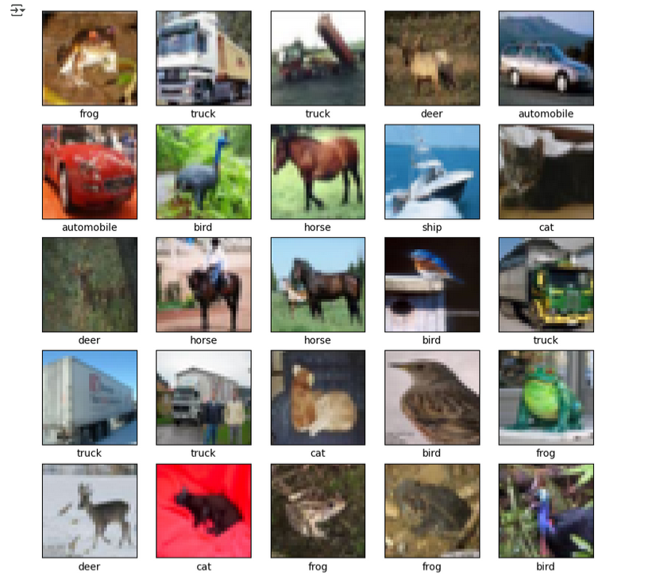

# 분석
---
**RMSprop**
>Optimizer : RMSprop 
Epochs : 20 
Batch_size : 256

>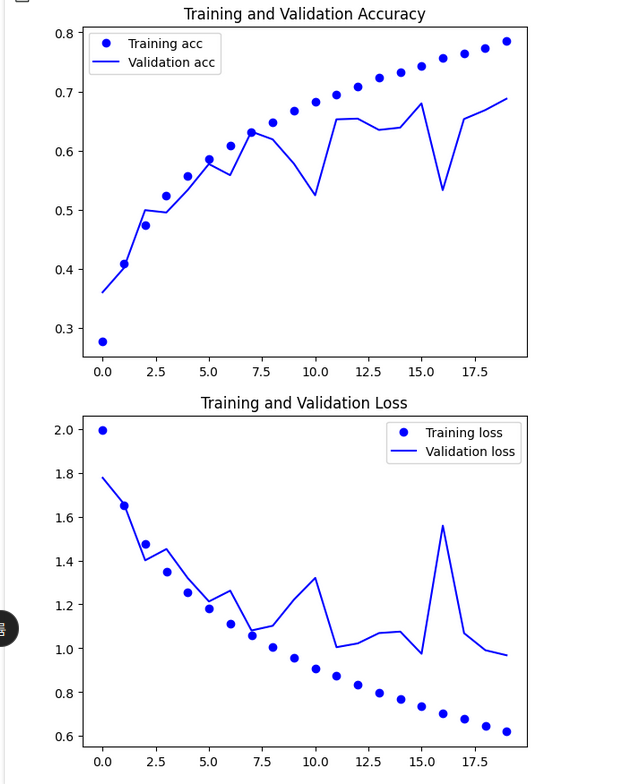그래프 결과

 

**RMSprop _2**
>Optimizer : RMSprop 
Epochs : 20 
Batch_size : 128

>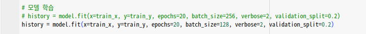모델 학습 
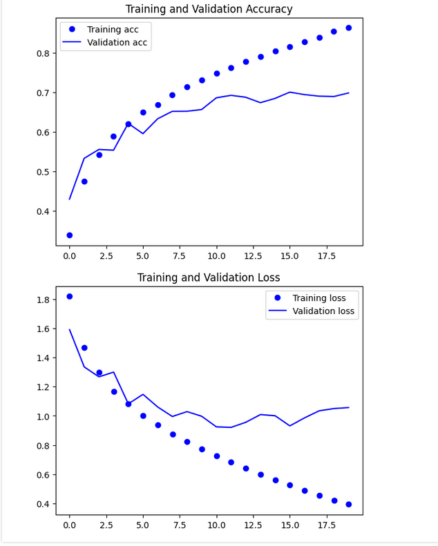그래프 결과

 

**SGD + Momentum**
>Optimizer : SGD + Momentum (Learning_rate = 0.01, Momentum = 0.9) 
Epochs : 20 
Batch_size : 256

>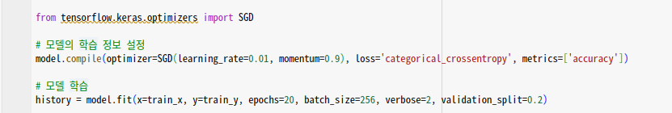모델 학습 
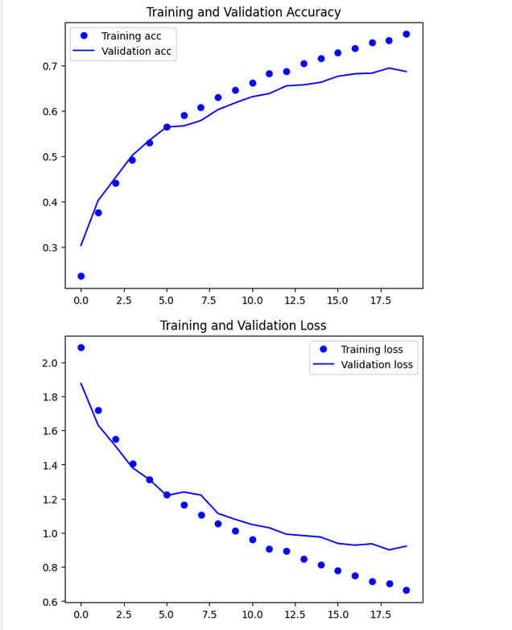그래프 결과

 

**SGD + Momentum _2**
>Optimizer : SGD + Momentum (Learning_rate = 0.01, Momentum = 0.9) 
Epochs : 20 
Batch_size : 128

>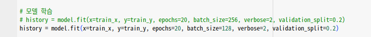모델 학습 
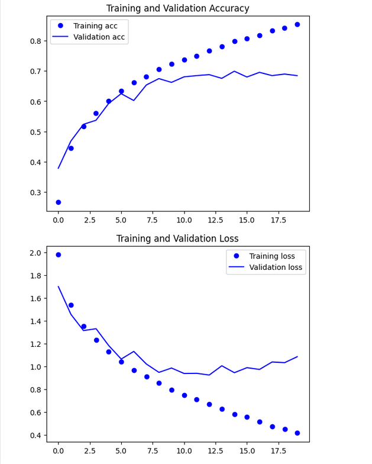그래프 결과

 

**Adam**
>Optimizer : Adam (Learning_rate = 0.0001) 
Epochs : 20 
Batch_size : 256

>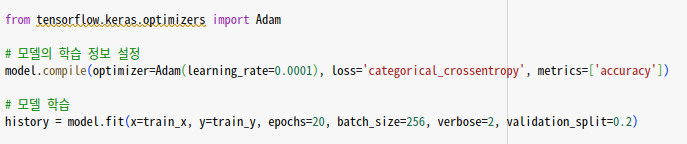모델 학습 
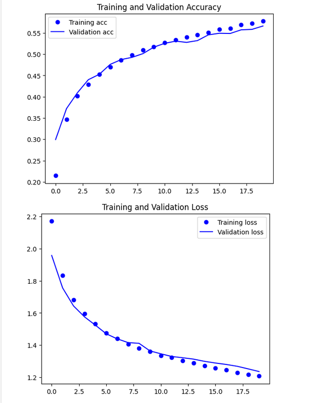그래프 결과

 

**Adam _2**
>Optimizer : Adam (Learning_rate = 0.0001) 
Epochs : 20 
Batch_size : 128

>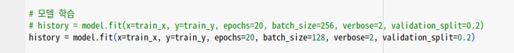모델 학습 
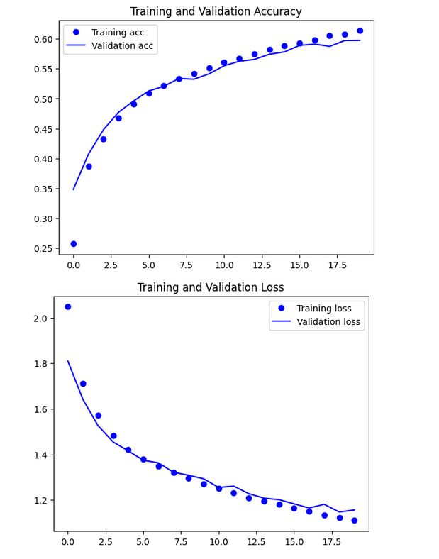그래프 결과

 

**Adam _3**
>Optimizer : Adam (Learning_rate = 0.0005) 
Epochs : 60 
Batch_size : 256 

>Learning_rate 조절 (0.0001 -> 0.0005) 
Dropout 추가 (0.15 / 0.15 / 0.3) 
BatchNormalization 추가 

>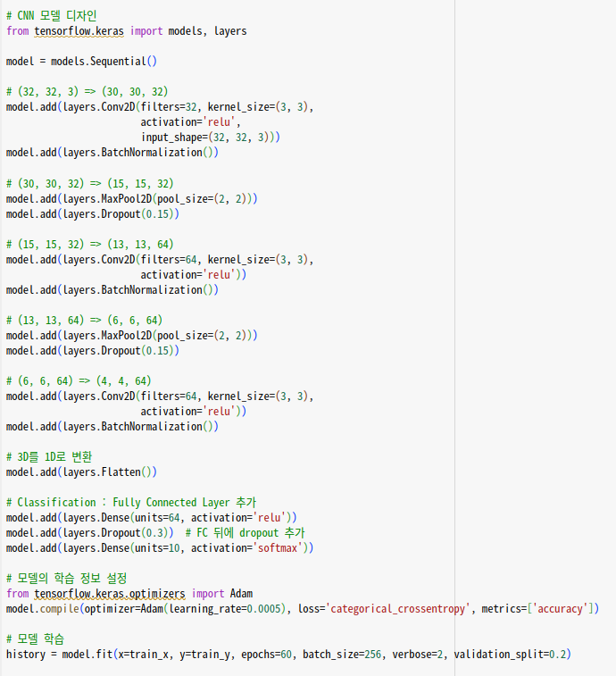모델 학습 
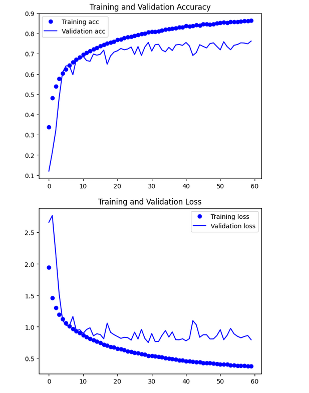그래프 결과

 

**Adam _4**
>Optimizer : Adam (Learning_rate = 0.0005) 
Epochs : 60 
Batch_size : 128 

>Learning_rate 조절 (0.0001 -> 0.0005) 
Dropout 추가 (0.15 / 0.15 / 0.3) 
BatchNormalization 추가 

>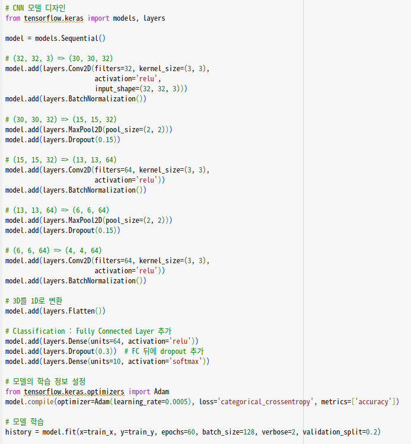모델 학습 
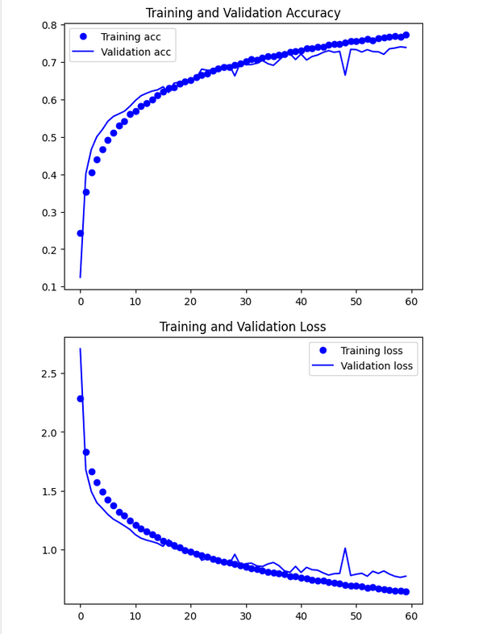그래프 결과

# 고찰
---
제공된 실험 결과를 종합해 볼 때, 최적의 CNN 모델은 ADAM 옵티마이저를 사용하고 LEARNING_RATE = 0.0005, EPOCHS = 60, BATCH_SIZE = 128의 하이퍼파라미터 조건을 가졌을 때 나타났습니다. 이 모델은 layers.Dropout (0.15 / 0.15 / 0.3)과 layers.BatchNormalization을 추가하여 성능을 향상시켰습니다.
해당 조건에서 Training Accuracy는 약 0.85 이상, Validation Accuracy는 약 0.75 이상으로 수렴하며 안정적인 학습 곡선을 보였습니다. Training Loss와 Validation Loss 또한 60 에포크 동안 꾸준히 감소하며 낮은 값을 유지했습니다. 특히, Validation Accuracy 그래프가 다른 설정에 비해 더 높은 안정성과 최종 정확도를 보였습니다.

|Optimizer|Learning rate|Epochs|Batch size|Dropout|BatchNormalization|
|:---:|:---:|:---:|:---:|:---:|:---:|
|Adam|0.0005|60|128|0.15 / 0.15 / 0.3| 있음 

< 하이퍼파라미터별 분석 >

OPTIMIZER:
- RMSPROP과 SGD + MOMENTUM에 비해 ADAM 옵티마이저가 전반적으로 더 나은 성능을 보였습니다. 특히 ADAM은 학습 초기부터 더 빠르게 수렴하고, Validation Accuracy의 변동 폭이 적어 안정적인 학습이 가능하게 했습니다.
      
LEARNING_RATE:
- ADAM 옵티마이저를 기준으로, LEARNING_RATE = 0.0005가 0.0001보다 더 높은 최종 정확도와 더 빠른 수렴 속도를 보였습니다. 학습률이 너무 낮으면 학습이 더디게 진행될 수 있으며, 너무 높으면 최적점을 지나쳐 발산할 위험이 있습니다.
      
EPOCHS:
- EPOCHS = 20에서 학습을 종료한 모델들은 대부분 Validation Accuracy가 더 이상 크게 증가하지 않거나 오히려 불안정한 모습을 보였습니다. 반면 EPOCHS = 60으로 설정했을 때, 모델은 충분히 학습되어 Training Accuracy와 Validation Accuracy 모두 더 높은 값에 도달했으며 Loss 값도 안정적으로 감소했습니다. 에포크 수가 부족하면 모델이 충분히 학습되지 않아 underfitting이 발생할 수 있고, 너무 많으면 overfitting이 발생할 수 있습니다.

BATCH_SIZE:
- BATCH_SIZE = 128이 BATCH_SIZE = 256보다 Validation Accuracy가 더 안정적이고 최종적으로 높은 성능을 보이는 경향이 있었습니다. 이는 작은 배치 크기가 더 많은 업데이트를 통해 모델이 더 세밀하게 학습되고, 지역 최적점에 덜 빠지게 하는 효과가 있었기 때문으로 보입니다.
      
layers.Dropout:
- layers.Dropout (0.15 / 0.15 / 0.3) 추가는 모델의 과적합(overfitting)을 방지하는 데 기여했습니다. Validation Accuracy와 Training Accuracy 간의 간격이 줄어들고, Validation Accuracy가 더 안정적으로 유지되는 것을 통해 이를 확인할 수 있습니다. 드롭아웃 비율이 적절하지 않으면 underfitting이나 여전히 overfitting이 발생할 수 있습니다.

layers.BatchNormalization:
- layers.BatchNormalization 추가는 학습의 안정성을 높이고 수렴 속도를 빠르게 하는 데 도움을 주었습니다. 이는 특히 깊은 네트워크에서 각 레이어의 입력 분포를 정규화하여 학습을 용이하게 하는 효과가 있습니다.

결론적으로, 본 실험에서는 ADAM 옵티마이저와 적절히 조절된 학습률(0.0005), 충분한 에포크(60), 그리고 모델의 복잡도에 맞는 배치 크기(128) 및 정규화 기법(Dropout, BatchNormalization)의 조합이 CIFAR-10 데이터셋 분류에 가장 효과적인 성능을 나타냈습니다.
