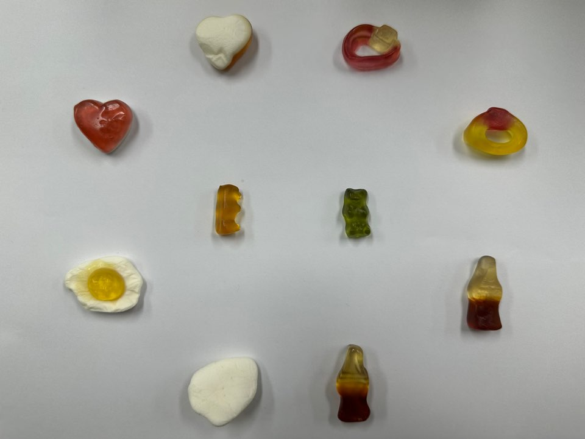

# Code
---
**Import**
>

 

**Google drive mount**
>

 

**Dataset**
>

 

**클래스 이름 자동 추출**
>

 

**데이터 증강 설정**
>

 

**데이터 로딩**
>

 

**모델 구성**
>

 

**콜백 설정**
>

 

**모델 학습**
>

 

**결과 시각화**
>

 

**학습 이미지 예시**
>

 

**카메라 설정**
>

# 분석
---
**Accuracy & Loss**
>

 

**Graph**
>

# 고찰
---
**1. 모델의 중요한 부분 및 파라미터 설정**

전이 학습(Transfer Learning) 기법을 활용하여 하리보 젤리 이미지를 분류하는 CNN 모델을 구축했습니다. 특히, 사전 학습된 MobileNetV2 모델을 기반으로 한 점이 핵심입니다.

1.1. 모델 아키텍처 (Model Architecture)

>base_model = MobileNetV2(input_shape=(96, 96, 3), include_top=False, weights='imagenet'):
>>MobileNetV2 사용: 이 모델은 모바일 및 임베디드 장치에 최적화된 경량 CNN 아키텍처입니다. 효율적인 연산으로 좋은 성능을 내는 것으로 알려져 있습니다.
>
>>input_shape=(96, 96, 3): 입력 이미지의 크기를 96x96 픽셀로 설정했습니다. 3은 RGB 채널을 의미합니다. 이는 MobileNetV2가 요구하는 일반적인 입력 크기 중 하나입니다.
>
>>include_top=False: MobileNetV2의 최상단(Top) 부분, 즉 ImageNet 데이터셋의 1000개 클래스를 분류하는 Dense 레이어를 제거했습니다. 이는 우리의 하리보 젤리 분류 문제에 맞게 새로운 분류 레이어를 추가하기 위함입니다.
>
>>weights='imagenet': ImageNet 데이터셋으로 사전 학습된 가중치를 사용합니다. 이것이 바로 전이 학습의 핵심입니다. MobileNetV2가 이미 수백만 장의 다양한 이미지에서 일반적인 시각적 특징(에지, 질감, 모양 등)을 학습했기 때문에, 우리 모델은 이러한 유용한 특징 추출 능력을 물려받아 작은 데이터셋으로도 좋은 성능을 낼 수 있습니다.

>base_model.trainable = False:
>>사전 학습된 MobileNetV2 모델의 가중치를 동결(freeze)시켰습니다. 즉, 학습 과정에서 MobileNetV2 내부의 가중치는 업데이트되지 않습니다. 이는 작은 데이터셋으로 전체 모델을 미세 조정할 때 발생할 수 있는 과대적합(overfitting)을 방지하고, 학습 속도를 빠르게 하는 데 도움이 됩니다.

>새로운 분류 헤드 추가:
>>layers.GlobalAveragePooling2D(): MobileNetV2의 출력 피처 맵(feature map)을 단일 벡터로 평활화(flatten)합니다. 이는 단순히 Flatten하는 것보다 파라미터 수를 줄여 과대적합을 완화하는 효과가 있습니다. 각 피처 맵의 평균값을 취합니다.
>
>>layers.Dense(128, activation='relu'): 128개의 뉴런을 가진 완전 연결(Dense) 레이어를 추가했습니다. relu (Rectified Linear Unit) 활성화 함수는 비선형성을 도입하여 모델이 더 복잡한 패턴을 학습할 수 있게 합니다.
>
>>layers.Dropout(0.5): 드롭아웃(Dropout)은 과대적합을 방지하기 위한 중요한 규제(regularization) 기법입니다. 학습 중 무작위로 뉴런의 50%를 비활성화하여, 모델이 특정 뉴런에 과도하게 의존하는 것을 막고 일반화 성능을 향상시킵니다.
>
>>layers.Dense(len(class_names), activation='softmax'): 최종 출력 레이어입니다. len(class_names)는 하리보 젤리의 종류 수에 해당하며, softmax 활성화 함수는 각 클래스에 대한 확률 분포를 출력합니다. 모든 클래스의 확률 합은 1이 됩니다.

1.2. 중요 파라미터 설정 (Hyperparameter Settings)

>데이터 증강 (ImageDataGenerator):
>>rescale=1./255: 이미지 픽셀 값을 [0, 255]에서 [0, 1] 범위로 정규화합니다. 이는 신경망 학습에 필수적입니다.
>
>>validation_split=0.2: 전체 데이터셋의 20%를 검증 데이터로 분할합니다.
>
>>rotation_range=90, width_shift_range=0.1, height_shift_range=0.1, shear_range=0.1, zoom_range=0.1, horizontal_flip=True, fill_mode='nearest': 이러한 파라미터들은 데이터 증강(Data Augmentation)을 위한 설정입니다. 제한된 데이터셋의 크기를 효과적으로 늘리고 모델의 일반화 성능을 향상시키기 위해 사용됩니다. 이미지를 회전, 이동, 확대/축소, 반전시키는 등 다양한 변형을 주어 모델이 실제 환경에서 나타날 수 있는 다양한 상황에 강인하게 만듭니다.

>옵티마이저 (Adam(learning_rate=1e-4)):
>>Adam 옵티마이저: Adagrad, RMSprop의 장점을 결합한 효율적인 경사 하강법 변형으로, 보편적으로 좋은 성능을 보여줍니다.
>
>>학습률 (1e-4, 즉 0.0001): 비교적 작은 학습률을 사용했습니다. 전이 학습 시 사전 학습된 가중치를 미세 조정할 때, 큰 학습률은 학습된 특징을 망가뜨릴 수 있으므로, 작은 학습률을 사용하는 것이 일반적입니다.

>손실 함수 (loss='categorical_crossentropy'):
>>다중 클래스 분류 문제에 적합한 손실 함수입니다. 모델의 예측 확률 분포와 실제 레이블의 원-핫 인코딩 사이의 차이를 측정합니다. class_mode='categorical'과 함께 사용됩니다.

>평가 지표 (metrics=['accuracy']):
>>모델의 성능을 평가할 주요 지표로 '정확도(accuracy)'를 사용했습니다. 이는 올바르게 분류된 샘플의 비율을 나타냅니다.

>에포크 (epochs=50):
>>모델이 전체 훈련 데이터를 50번 반복하여 학습하도록 설정했습니다.

>배치 크기 (batch_size=32):
>>한 번의 가중치 업데이트에 사용되는 데이터 샘플의 개수를 32개로 설정했습니다.

>콜백 (EarlyStopping, ModelCheckpoint):
>>EarlyStopping(monitor='val_loss', patience=5, restore_best_weights=True): 조기 종료 콜백입니다. val_loss (검증 손실)를 모니터링하여, 5 에포크 동안 val_loss가 개선되지 않으면 학습을 조기 종료합니다. restore_best_weights=True는 학습이 끝났을 때 검증 손실이 가장 좋았던 에포크의 가중치로 모델을 복원합니다. 이는 과대적합을 방지하고 최적의 모델을 얻는 데 매우 중요합니다.
>
>>ModelCheckpoint('best_model.h5', save_best_only=True): 모델 체크포인트 콜백입니다. 학습 중 검증 성능이 가장 좋은 모델(val_loss가 가장 낮은 모델)을 'best_model.h5' 파일로 자동 저장합니다.

**2. 실행 결과 분석**

2.1. 훈련 및 검증 정확도/손실 그래프 분석

>훈련/검증 정확도 (Training and Validation Accuracy) 그래프:
>>초기 학습 (Epoch 0-10): 훈련 정확도와 검증 정확도 모두 빠르게 상승합니다. 특히 훈련 정확도는 0.2에서 0.7-0.8 근처까지 빠르게 증가합니다. 검증 정확도도 0.4에서 0.7-0.8 수준으로 따라 올라갑니다. 이 단계에서는 모델이 기본적인 특징을 빠르게 학습하고 있음을 보여줍니다.
>
>>중기 학습 (Epoch 10-30): 훈련 정확도는 꾸준히 상승하여 0.85-0.9 수준에 도달합니다. 검증 정확도 또한 비슷한 추세로 상승하여 0.8-0.9 사이를 오갑니다. 이 구간에서 검증 정확도의 변동폭이 다소 크게 나타나는데, 이는 데이터 증강, 드롭아웃, 또는 배치 크기 등으로 인한 학습의 불안정성일 수 있습니다.
>
>>후기 학습 (Epoch 30-45): 훈련 정확도는 0.9 이상으로 매우 높게 유지됩니다. 검증 정확도도 0.85-0.92 수준으로 꾸준히 높은 값을 보입니다.
>
>>과대적합 징후: 그래프 상에서 훈련 정확도와 검증 정확도 간의 간극이 크지 않게 유지되는 편입니다. 특히 훈련 정확도가 0.9 이상으로 높아질 때, 검증 정확도도 비슷한 수준으로 따라 올라가며, 마지막 에포크 (약 45 에포크)에서는 검증 정확도가 훈련 정확도에 근접하거나 심지어 약간 더 높아지는(최고 0.9252) 모습도 보입니다. 이는 모델이 과대적합되지 않고 잘 일반화되고 있음을 시사합니다. 조기 종료(Early Stopping) 덕분에 불필요한 과대적합이 방지되었을 가능성이 높습니다.

>훈련/검증 손실 (Training and Validation Loss) 그래프:
>>초기 학습 (Epoch 0-10): 훈련 손실과 검증 손실 모두 급격하게 감소합니다. 모델이 빠르게 학습하고 오차를 줄여나가고 있음을 보여줍니다.
>
>>중기 학습 (Epoch 10-30): 손실 값이 계속해서 감소하지만, 감소 폭은 점차 줄어듭니다. 검증 손실이 훈련 손실보다 약간 높거나 비슷한 수준을 유지하며, 0.4-0.3 수준까지 내려옵니다.
>
>>후기 학습 (Epoch 30-45): 훈련 손실은 0.2 이하로 매우 낮게 유지되며, 검증 손실도 0.2-0.3 수준에서 안정화됩니다. 검증 손실이 훈련 손실과 큰 차이를 보이지 않고, 마지막에는 0.2711까지 떨어지는 것으로 보아 모델이 과대적합 없이 잘 수렴했음을 알 수 있습니다.

2.2. 훈련 로그 분석 (텍스트 출력)

훈련 로그는 각 에포크별 훈련 정확도(accuracy), 훈련 손실(loss), 검증 정확도(val_accuracy), 검증 손실(val_loss)을 상세하게 보여줍니다. 몇 가지 주목할 만한 지점들을 살펴보겠습니다.

>Epoch 23/50: accuracy: 0.8756, loss: 0.3764, val_accuracy: 0.8763, val_loss: 0.4500
>>이 시점에서는 훈련 정확도와 검증 정확도가 거의 동일하며, 검증 손실이 훈련 손실보다 약간 높습니다.

>Epoch 25/50: accuracy: 0.9010, loss: 0.3260, val_accuracy: 0.8763, val_loss: 0.3964
>>훈련 정확도는 90%를 넘었지만, 검증 정확도는 아직 그에 미치지 못합니다.

>Epoch 30/50: accuracy: 0.9137, loss: 0.2717, val_accuracy: 0.8763, val_loss: 0.3580
>>훈련 정확도는 계속 상승하지만, 검증 정확도 상승은 둔화됩니다. 여기서부터 조기 종료의 patience가 카운트되기 시작할 수 있습니다.

>Epoch 32/50: accuracy: 0.9264, loss: 0.2485, val_accuracy: 0.9072, val_loss: 0.3102
>>검증 정확도가 90%를 넘어섰습니다.

>Epoch 41/50: accuracy: 0.9391, loss: 0.1948, val_accuracy: 0.9175, val_loss: 0.2673
>>훈련 및 검증 성능 모두 최고점에 도달하는 시점 중 하나입니다.

>Epoch 43/50: accuracy: 0.9264, loss: 0.2275, val_accuracy: 0.8660, val_loss: 0.3225
>- 훈련 정확도는 여전히 높지만, 검증 정확도와 손실이 다소 나빠지는 경향을 보입니다. 이는 조기 종료가 작동할 수 있는 시점입니다. patience=5 이므로, 이 시점 이후로 5 에포크 동안 val_loss가 더 나아지지 않으면 학습이 멈추게 됩니다.

>Epoch 46/50: accuracy: 0.9239, loss: 0.2026, val_accuracy: 0.8969, val_loss: 0.2711
>- 최종적으로 기록된 에포크입니다. 아마 이 이후로 조기 종료 조건이 만족되어 학습이 멈췄을 것입니다. 최종적으로 best_model.h5에는 val_loss가 가장 낮았던 에포크 (로그상으로는 Epoch 41의 val_loss: 0.2673 또는 그 근방)의 가중치가 저장되었을 것입니다.

2.3. 전반적인 성능 평가

설계한 CNN 모델은 하리보 젤리 모양 분류에 대해 매우 성공적인 학습을 수행했습니다.

>높은 정확도: 최종 검증 정확도가 약 90% 이상으로 매우 높습니다. 이는 모델이 하리보 젤리 모양을 효과적으로 구분하고 있음을 의미합니다.

>과대적합 제어: 훈련 정확도와 검증 정확도 간의 간극이 크지 않고, 검증 손실도 안정적으로 감소하는 것을 보아, 드롭아웃, 데이터 증강, 조기 종료와 같은 규제 기법들이 과대적합을 효과적으로 방지했다고 판단됩니다.

>전이 학습의 효과: MobileNetV2와 같은 사전 학습된 모델을 사용함으로써, 비교적 적은 데이터셋으로도 높은 성능을 달성할 수 있었을 것입니다.