# Code
---
**데이터 정보**
>

 

**CNN 모델 디자인**
>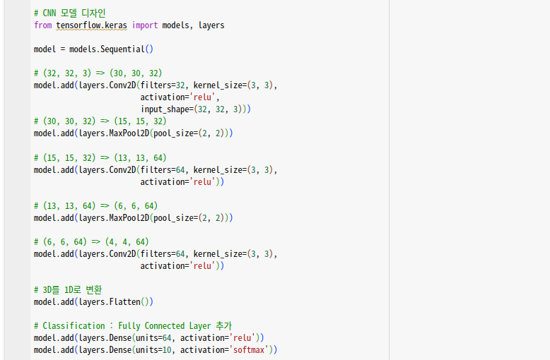

 

**모델 학습 정보 설정 및 학습**
>

 

**그래프 설정**
>

 

**데이터 수 확인**
>
>

 

**분류 결과 확인**
>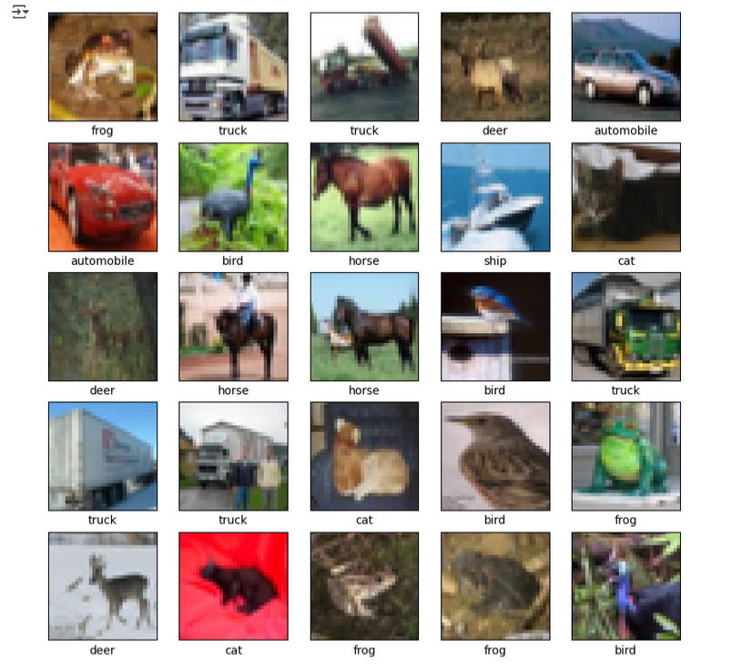

# 분석
---
**RMSprop**
>Optimizer : RMSprop 
Epochs : 20 
Batch_size : 256

>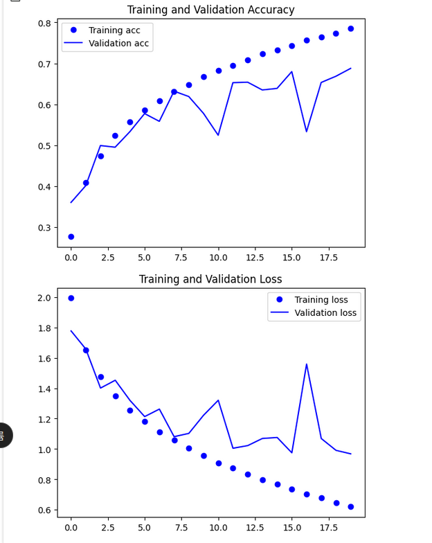그래프 결과

 

**RMSprop _2**
>Optimizer : RMSprop 
Epochs : 20 
Batch_size : 128

>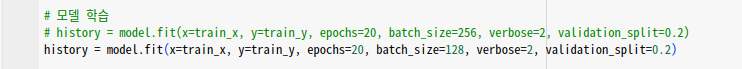모델 학습 
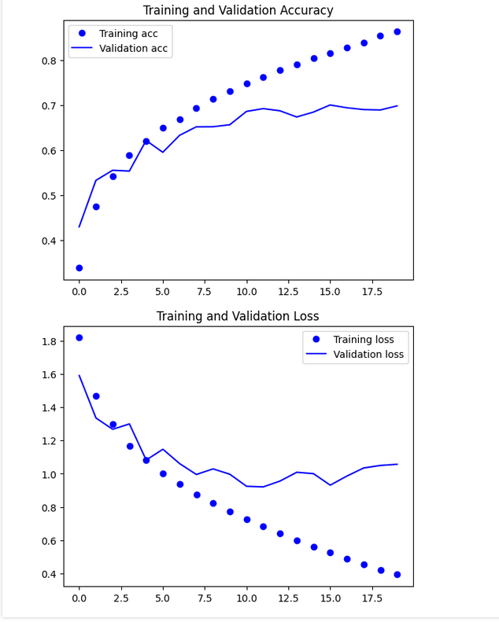그래프 결과

 

**SGD + Momentum**
>Optimizer : SGD + Momentum 
(Learning_rate = 0.01, Momentum = 0.9) 
Epochs : 20 
Batch_size : 256

>모델 학습 
그래프 결과

 

**SGD + Momentum _2**
>Optimizer : SGD + Momentum 
(Learning_rate = 0.01, Momentum = 0.9) 
Epochs : 20 
Batch_size : 128

>모델 학습 
그래프 결과

 

**Adam**
>Optimizer : Adam 
(Learning_rate = 0.0001) 
Epochs : 20 
Batch_size : 256

>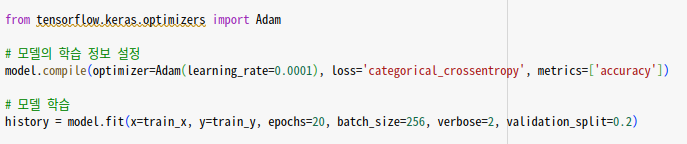모델 학습 
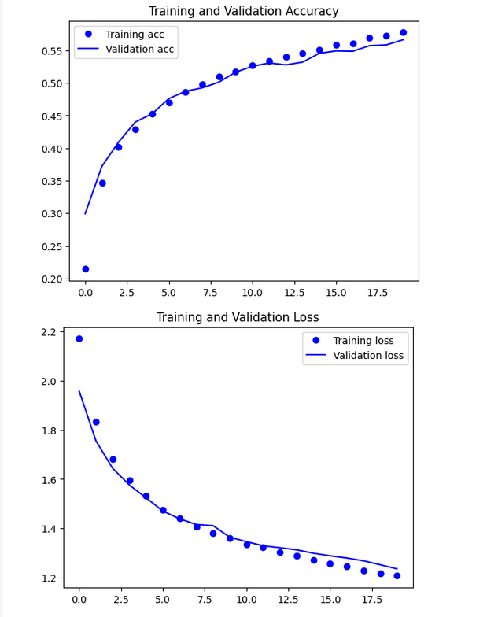그래프 결과

 

**Adam _2**
>Optimizer : Adam 
(Learning_rate = 0.0001) 
Epochs : 20 
Batch_size : 128

>모델 학습 
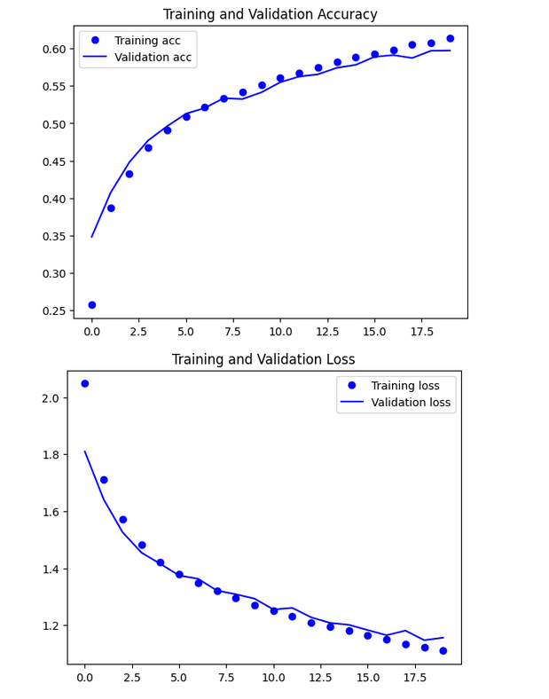그래프 결과

 

**Adam _3**
>Optimizer : Adam 
(Learning_rate = 0.0005) 
Epochs : 60 
Batch_size : 256 

>Learning_rate 조절 
Dropout 추가 
(0.15 / 0.15 / 0.3) 
BatchNormalization 추가 

>모델 학습 
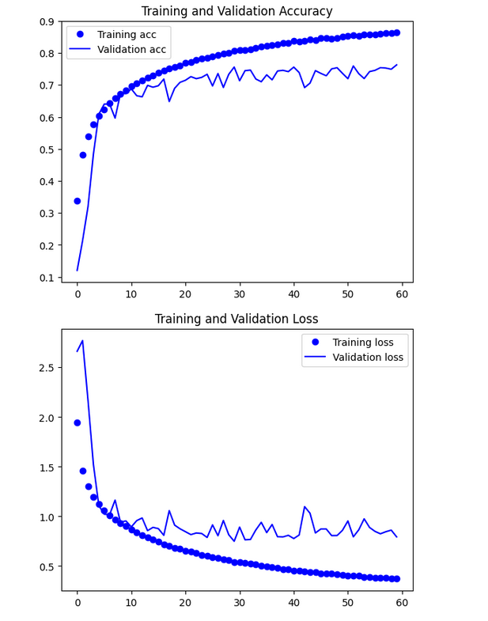그래프 결과

 

**Adam _4**
>Optimizer : Adam 
(Learning_rate = 0.0005) 
Epochs : 60 
Batch_size : 128 

>Learning_rate 조절 
Dropout 추가 
(0.15 / 0.15 / 0.3) 
BatchNormalization 추가 

>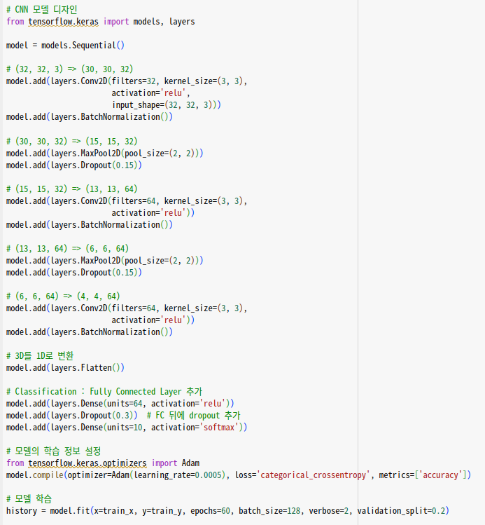모델 학습 
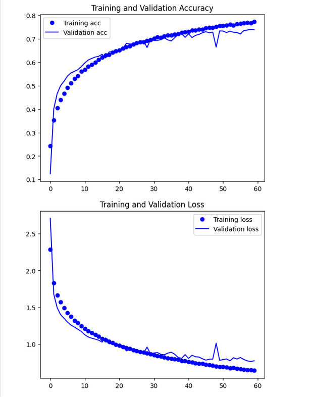그래프 결과

# 고찰
---

