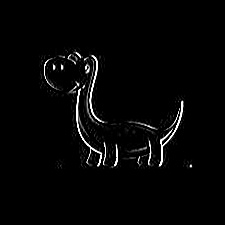
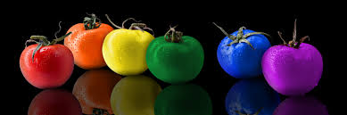

# Code
---
**jpeg to png**
```
import numpy as np
import cv2

img = cv2.imread("dino.jpeg")

cv2.namedWindow("image", cv2.WINDOW_NORMAL)

print(img.shape)

# Road 한 이미지 파일을 Display
cv2.imshow("image",img)

# 키 입력이 있을 때까지 대기
key = cv2.waitKey(0)

# s 가 입력되면 저장, 아니면 종료
if key == ord('s'):
    cv2.imwrite("output.png",img)
    print("저장을 완료했습니다.")
else:
    print("저장하지 않았습니다.")

cv2.destroyAllWindows()
```
**Cropped & Resized**
```
import numpy as np
import cv2

# 이미지 파일을 Read
img = cv2.imread("dino.jpeg")

# Crop 80x60 from original image from (30,40)=(x,y)
cropped = img[40:100,30:110]
cv2.imwrite("Cropped image.jpg",cropped)

# Resize cropped image from 80x60 to 400x200
resized = cv2.resize(cropped, (400,200))
cv2.imwrite("Resized image.jpg",resized)

# Display all
cv2.imshow("Original",img)
cv2.imshow("Cropped image",cropped)
cv2.imshow("Resized image",resized)

cv2.waitKey(0)
cv2.destroyAllWindows()
```
**Reversed**
```
import cv2

src = cv2.imread("dino.jpeg", cv2.IMREAD_COLOR)
dst = cv2.bitwise_not(src)

# 반전
cv2.imshow("src",src)
cv2.imshow("dst",dst)
cv2.imwrite("reverse.jpg",dst)

cv2.waitKey(0)
cv2.destroyAllWindows()
```
**Threshold**
```
import cv2

src = cv2.imread("dino.jpeg",cv2.IMREAD_COLOR)

# 임계값 변화
gray = cv2.cvtColor(src,cv2.COLOR_BGR2GRAY)
ret, dst = cv2.threshold(gray,100,255,cv2.THRESH_BINARY)

cv2.imshow("dst",dst)
cv2.imwrite("threshold.jpg",dst)

cv2.waitKey(0)
cv2.destroyAllWindows()
```
**Blur**
```
import cv2

src = cv2.imread("dino.jpeg",cv2.IMREAD_COLOR)
dst = cv2.blur(src, (9,9), anchor=(-1,-1), borderType=cv2.BORDER_DEFAULT)

cv2.imshow("dst",dst)
cv2.imwrite("blur.jpg",dst)

cv2.waitKey(0)
cv2.destroyAllWindows()
```
**Sobel & Laplacian & Canny**
```
import cv2

src = cv2.imread("dino.jpeg",cv2.IMREAD_COLOR)
gray = cv2.cvtColor(src,cv2.COLOR_BGR2GRAY)

sobel = cv2.Sobel(gray, cv2.CV_8U, 1, 0, 3)
laplacian = cv2.Laplacian(gray, cv2.CV_8U, 3)
canny = cv2.Canny(gray, 50, 200, 3)

cv2.imshow("sobel", sobel)
cv2.imwrite("sobel.jpg",sobel)

cv2.imshow("laplacian", laplacian)
cv2.imwrite("laplacian.jpg",laplacian)

cv2.imshow("canny", canny)
cv2.imwrite("canny.jpg", canny)

cv2.waitKey(0)
cv2.destroyAllWindows()
```
**BGR & HSV**
```
import numpy as np
import cv2

# 이미지 파일을 Read 하고 Color space 정보 출력
color = cv2.imread("strawberry.jpeg", cv2.IMREAD_COLOR)
# color = cv2.imread("strawberry_dark.jpeg", cv2.IMREAD_COLOR)
print(color.shape)

height,width,channels = color.shape
cv2.imshow("Original Image",color)

# Color channel을 B,G,R로 분할하여 출력
b,g,r = cv2.split(color)
rgb_split = np.concatenate((b,g,r),axis=1)
cv2.imshow("BGR Channels",rgb_split)
cv2.imwrite("BGR Channels output.jpg",rgb_split)

# 색공간을 BGR 에서 HSV 로 변환
hsv = cv2.cvtColor(color, cv2.COLOR_BGR2HSV)

# Channel 을 H,S,V 로 분할하여 출력
h,s,v = cv2.split(hsv)
hsv_split = np.concatenate((h,s,v),axis=1)
cv2.imshow("Split HSV",hsv_split)
cv2.imwrite("Split HSV output.jpg",hsv_split)

cv2.waitKey(0)
cv2.destroyAllWindows()
```
**Split & Inverse**
```
import cv2

src = cv2.imread("tomato.jpeg",cv2.IMREAD_COLOR)
b,g,r=cv2.split(src)
inverse=cv2.merge((r,g,b))

cv2.imshow("b",b)
cv2.imwrite("b.jpg",b)

cv2.imshow("g",g)
cv2.imwrite("g.jpg",g)

cv2.imshow("r",r)
cv2.imwrite("r.jpg",r)

cv2.imshow("inverse",inverse)
cv2.imwrite("inverse.jpg",inverse)

cv2.waitKey(0)
cv2.destroyAllWindows()
```
# 분석
---
**Source.jpeg**
>

**jpeg to png**
>

**Cropped & Resized**
><br/>
Cropped<br/>
<br/>
Resized

**Reversed**
>

**Threshold**
>

**Blur**
>

**Sobel & Laplacian & Canny**
><br/>
Sobel<br/>
<br/>
Laplacian<br/>
<br/>
Canny Edge Detection

**BGR & HSV**
><br/>
source<br/>
<br/>
BGR<br/>
<br/>
HSV

**Split & Inverse**
><br/>
source<br/>
<br/>
b<br/>
<br/>
g<br/>
<br/>
r<br/>
<br/>
inverse