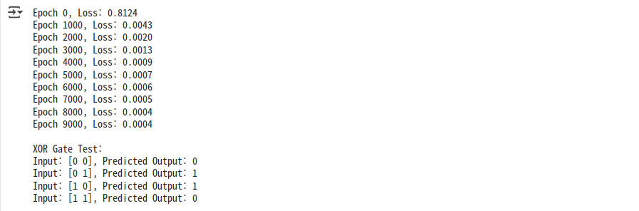
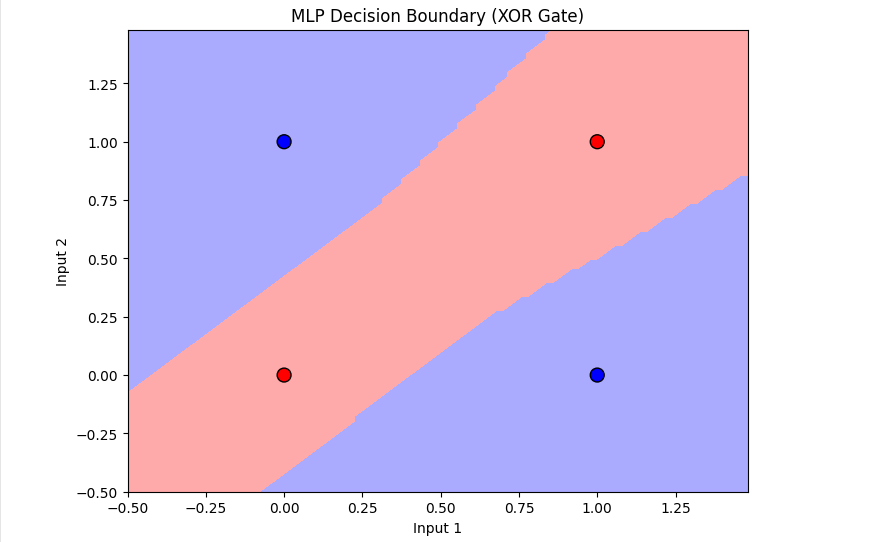
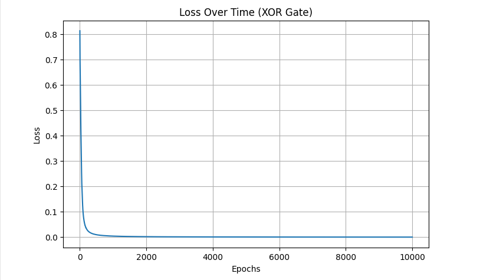

# Code
---
**Perceptron Model**
```
# 퍼셉트론 모델
import numpy as np
import matplotlib.pyplot as plt

class Perceptron:
  def __init__(self, input_size, lr=0.1, epochs=10):
    self.weights = np.zeros(input_size)
    self.bias = 0
    self.lr = lr
    self.epochs = epochs
    self.errors = []

  def activation(self, x):
    return np.where(x> 0, 1, 0)

  def predict(self, x ):
    linear_output = np.dot(x, self.weights) + self.bias
    return self.activation(linear_output)

  def train(self, X, y):
    for epoch in range(self.epochs):
      total_error = 0
      for xi, target in zip(X, y):
        prediction = self.predict(xi)
        update = self.lr * (target - prediction)
        self.weights += update * xi
        self.bias += update
        total_error += int(update != 0.0)
      self.errors.append(total_error)
      print(f"Epoch {epoch+1}/{self.epochs}, Errors: {total_error}")

# 결정 경계 시각화
from matplotlib.colors import ListedColormap화

def plot_decision_boundary(X, y, model):
  cmap_light = ListedColormap(['#FFAAAA','#AAAAFF'])
  cmap_bold = ListedColormap(['#FF0000', '#0000FF'])

  h = .02 # mesh grid 간격
  x_min, x_max = X[:,0].min() - 1, X[:,0].max() + 1
  y_min, y_max = X[:,0].min() - 1, X[:,0].max() + 1
  xx, yy = np.meshgrid(np.arange(x_min, x_max, h), np.arange(y_min, y_max, h))

  Z = model.predict(np.c_[xx.ravel(), yy.ravel()])
  Z = Z.reshape(xx.shape)

  plt.figure(figsize=(8,6))
  plt.contourf(xx, yy, Z, cmap=cmap_light)

  # 실제 데이터 포인트 표시
  plt.scatter(X[:,0], X[:,1], c=y, cmap=cmap_bold, edgecolor='k', s=100, marker='o')
  plt.xlabel('Input 1')
  plt.ylabel('Input 2')
  plt.title('Perceptron Decision Boundary')
  plt.show()

# 오류 시각화
plt.figure(figsize=(8,5))
plt.plot(range(1, len(ppn_and.errors) + 1), ppn_and.errors, marker='o')
plt.xlabel('Epochs')
plt.ylabel('Number of Errors')
plt.title('Perceptron Learning Error Over Epochs (AND Gate)')
plt.grid(True)
plt.show()
```
**AND Gate**
```
# AND 게이트 데이터
X_and = np.array([[0,0],[0,1],[1,0],[1,1]])
y_and = np.array([0,0,0,1])

# 퍼셉트론 모델 훈련
ppn_and = Perceptron(input_size=2)
ppn_and.train(X_and, y_and)

#예측 결과 확인
print("\nAND Gate Test:")
for x in X_and:
  print(f"Input: {x}, Predicted Output: {ppn_and.predict(x)}")

# AND 게이트 결정 경계 시각화
plot_decision_boundary(X_and, y_and, ppn_and)
```
**OR Gate**
```
# OR 게이트 데이터
X_or = np.array([[0,0],[0,1],[1,0],[1,1]])
y_or = np.array([0,1,1,1])

# OR 퍼셉트론 모델 훈련
ppn_or = Perceptron(input_size=2)
ppn_or.train(X_or, y_or)

#예측 결과 확인
print("\nOR Gate Test:")
for x in X_or:
    print(f"Input: {x}, Predicted Output: {ppn_or.predict(x)}")

# OR 게이트 결정 경계 시각화
plot_decision_boundary(X_and, y_and, ppn_and)
```
**NAND Gate**
```
# NAND 게이트 데이터
X_nand = np.array([[0,0],[0,1],[1,0],[1,1]])
y_nand = np.array([1,1,1,0])

# NAND 퍼셉트론 모델 훈련
ppn_nand = Perceptron(input_size=2)
ppn_nand.train(X_nand, y_nand)

# 예측 결과 확인
print("\nNAND Gate Test:")
for x in X_nand:
    print(f"Input: {x}, Predicted Output: {ppn_nand.predict(x)}")

# NAND 게이트 결정 경계 시각화
plot_decision_boundary(X_and, y_and, ppn_and)
```
**XOR Gate**
```
# XOR 게이트 데이터
X_xor = np.array([[0,0],[0,1],[1,0],[1,1]])
y_xor = np.array([0,1,1,0])

# XOR 퍼셉트론 모델 훈련
ppn_xor = Perceptron(input_size=2, epochs=20)
ppn_xor.train(X_xor, y_xor)

# 예측 결과 확인
print("\nXOR Gate Test:")
for x in X_xor:
    print(f"Input: {x}, Predicted Output: {ppn_xor.predict(x)}")

# XOR 게이트 결정 경계 시각화
plot_decision_boundary(X_and, y_and, ppn_and)
```
# 분석
---
**AND Gate**
>예상결과<br/>
게이트 결정 경계 시각화<br/>
오류 시각화

<br/>

**OR Gate**
>예상결과<br/>
게이트 결정 경계 시각화<br/>
오류 시각화

<br/>

**NAND Gate**
>예상결과<br/>
게이트 결정 경계 시각화<br/>
오류 시각화

<br/>

**XOR Gate**
>예상결과<br/>
게이트 결정 경계 시각화<br/>
오류 시각화

# 고찰
---
**XOR Gate**
퍼셉트론은 가장 기본적인 형태의 인공 신경망으로, 입력을 받아 가중치를 곱한 후 활성화 함수를 적용하여 출력을 계산.
하지만 이 단일 계층 구조로는 XOR 게이트 문제를 해결할 수 없음.

|입력A|입력B|출력|
|:---:|:---:|:---:|
|0|0|1|
|0|1|1|
|1|0|1|
|1|1|0|

이 문제는 선형적으로 분리할 수 없는 데이터이기 때문에, 단일 퍼셉트론으로는 어떠한 선형 결정 경계로도 올바른 출력을 분리해낼 수 없음.

**MLP(Multi Layer Perceptron)의 필요성**
비선형적으로 분리 가능한 데이털르 해결하기 위해서는 하나 이상의 은닉층을 갖는 다층 퍼셉트론이 필요함. 은닉층을 통해 비선형성을 학습할 수 있고, 이로 인해 더 복잡한 함수도 근사할 수 있게 됨.

**이진 분류와 손실 함수**
출력이 0 또는 1인 이진 분류 문제에서는, 손실 함수로 Binary Cross Entropy를 사용함.
이 손실 함수는 예측값과 실제값 사이의 차이를 측정하며, 모델의 출력이 정답에 가까워질수록 손실 값은 0에 수렴.

**Gradient Descent를 통한 학습**
손실 함수 값을 줄이기 위해 경사하강법(gradient descent)을 사용하여 가중치를 업데이트함. 이때 중요한 요소는 학습률.
>학습률이 너무 작으면, 학습 속도가 매우 느려지고 극소에 갇힐 수 있음.

>학습률이 너무 크면, 최적점을 지나치거나 발산하여 학습이 실패할 수 있음.

따라서 적절한 학습률 설정이 모델 성능에 큰 영향을 미침.

**활성화 함수: ReLU와 Sigmoid**
>ReLU<br/>
- 계산이 빠르고
- 비선형성을 유지할 수 있어 딥러닝에 널리 쓰임.

>Sigmoid<br/>
- 출력이 0과 1 사이의 확률로 해석 될 수 있음.

**Epoch와 Overfitting 문제**
모델을 학습할 때 전체 데이터셋을 여러 번 반복해서 학습하는 과정을 Epoch이라고 함.
하지만 너무 많은 Epoch을 사용하면 모델이 학습 데이터에 과도하게 적응하면서 과적합이 발생할 수 있음.
이를 방지하기 위해 다음과 같은 기법을 사용할 수 있음.
>Dropout<br/>
- 학습 중 일부 뉴런을 임의로 비활성화시켜 과적합 방지.

>Early Stopping<br/>
- 검증 손실이 더 이상 개선되지 않으면 학습을 조기 종료.

**XOR Gate by MLP**
```
import numpy as np
import matplotlib.pyplot as plt
from matplotlib.colors import ListedColormap

# XOR 데이터셋
X_xor = np.array([[0,0],[0,1],[1,0],[1,1]])
y_xor = np.array([[0],[1],[1],[0]])  # 2D로 reshape

# 활성화 함수
def sigmoid(x):
    return 1 / (1 + np.exp(-x))

def sigmoid_deriv(x):
    return sigmoid(x) * (1 - sigmoid(x))

def relu(x):
    return np.maximum(0, x)

def relu_deriv(x):
    return (x > 0).astype(float)

# MLP 클래스
# 입력층의 노드 개수 : 1개, 은닉층 : 1개 , 은닉층의 노드 개수 : 4개 , 출력층의 노드 개수 : 1개
class SimpleMLP:
    def __init__(self, input_size=2, hidden_size=4, lr=0.1, epochs=10000):
        self.lr = lr
        self.epochs = epochs
        # 가중치 초기화개
        self.W1 = np.random.randn(input_size, hidden_size)
        self.b1 = np.zeros((1, hidden_size))
        self.W2 = np.random.randn(hidden_size, 1)
        self.b2 = np.zeros((1, 1))
        self.losses = []

    def train(self, X, y):
        for epoch in range(self.epochs):
            # 순전파
            z1 = X @ self.W1 + self.b1
            a1 = relu(z1)
            z2 = a1 @ self.W2 + self.b2
            a2 = sigmoid(z2)

            # 손실 계산 (binary cross-entropy)
            loss = -np.mean(y * np.log(a2 + 1e-8) + (1 - y) * np.log(1 - a2 + 1e-8))
            self.losses.append(loss)

            # 역전파
            dz2 = a2 - y
            dW2 = a1.T @ dz2
            db2 = np.sum(dz2, axis=0, keepdims=True)

            da1 = dz2 @ self.W2.T
            dz1 = da1 * relu_deriv(z1)
            dW1 = X.T @ dz1
            db1 = np.sum(dz1, axis=0, keepdims=True)

            # 파라미터 업데이트
            self.W1 -= self.lr * dW1
            self.b1 -= self.lr * db1
            self.W2 -= self.lr * dW2
            self.b2 -= self.lr * db2

            # 로그 출력
            if epoch % 1000 == 0:
                print(f"Epoch {epoch}, Loss: {loss:.4f}")

    def predict(self, X):
        z1 = X @ self.W1 + self.b1
        a1 = relu(z1)
        z2 = a1 @ self.W2 + self.b2
        a2 = sigmoid(z2)
        return (a2 > 0.5).astype(int)

# XOR 학습
mlp_xor = SimpleMLP()
mlp_xor.train(X_xor, y_xor)

# 예측 결과
print("\nXOR Gate Test:")
for x in X_xor:
    pred = mlp_xor.predict(np.array([x]))[0][0]
    print(f"Input: {x}, Predicted Output: {pred}")

# 결정 경계 시각화 함수
def plot_decision_boundary(X, y, model):
    cmap_light = ListedColormap(['#FFAAAA', '#AAAAFF'])
    cmap_bold = ListedColormap(['#FF0000', '#0000FF'])

    h = .02
    x_min, x_max = X[:, 0].min() - 0.5, X[:, 0].max() + 0.5
    y_min, y_max = X[:, 1].min() - 0.5, X[:, 1].max() + 0.5
    xx, yy = np.meshgrid(np.arange(x_min, x_max, h),
                         np.arange(y_min, y_max, h))

    grid = np.c_[xx.ravel(), yy.ravel()]
    Z = model.predict(grid)
    Z = Z.reshape(xx.shape)

    plt.figure(figsize=(8, 6))
    plt.contourf(xx, yy, Z, cmap=cmap_light)
    plt.scatter(X[:, 0], X[:, 1], c=y.ravel(), cmap=cmap_bold, edgecolor='k', s=100)
    plt.title("MLP Decision Boundary (XOR Gate)")
    plt.xlabel("Input 1")
    plt.ylabel("Input 2")
    plt.show()

# 결정 경계 시각화
plot_decision_boundary(X_xor, y_xor, mlp_xor)

# 손실 시각화
plt.figure(figsize=(8, 5))
plt.plot(mlp_xor.losses)
plt.xlabel("Epochs")
plt.ylabel("Loss")
plt.title("Loss Over Time (XOR Gate)")
plt.grid(True)
plt.show()
```
>예1상결과<br/>
게이트 결정 결계 시각화<br/>
손실 시각화
