# Code
---
**Perceptron Model**
```
# 퍼셉트론 모델
import numpy as np
import matplotlib.pyplot as plt

class Perceptron:
  def __init__(self, input_size, lr=0.1, epochs=10):
    self.weights = np.zeros(input_size)
    self.bias = 0
    self.lr = lr
    self.epochs = epochs
    self.errors = []

  def activation(self, x):
    return np.where(x> 0, 1, 0)

  def predict(self, x ):
    linear_output = np.dot(x, self.weights) + self.bias
    return self.activation(linear_output)

  def train(self, X, y):
    for epoch in range(self.epochs):
      total_error = 0
      for xi, target in zip(X, y):
        prediction = self.predict(xi)
        update = self.lr * (target - prediction)
        self.weights += update * xi
        self.bias += update
        total_error += int(update != 0.0)
      self.errors.append(total_error)
      print(f"Epoch {epoch+1}/{self.epochs}, Errors: {total_error}")

# 결정 경계 시각화
from matplotlib.colors import ListedColormap화

def plot_decision_boundary(X, y, model):
  cmap_light = ListedColormap(['#FFAAAA','#AAAAFF'])
  cmap_bold = ListedColormap(['#FF0000', '#0000FF'])

  h = .02 # mesh grid 간격
  x_min, x_max = X[:,0].min() - 1, X[:,0].max() + 1
  y_min, y_max = X[:,0].min() - 1, X[:,0].max() + 1
  xx, yy = np.meshgrid(np.arange(x_min, x_max, h), np.arange(y_min, y_max, h))

  Z = model.predict(np.c_[xx.ravel(), yy.ravel()])
  Z = Z.reshape(xx.shape)

  plt.figure(figsize=(8,6))
  plt.contourf(xx, yy, Z, cmap=cmap_light)

  # 실제 데이터 포인트 표시
  plt.scatter(X[:,0], X[:,1], c=y, cmap=cmap_bold, edgecolor='k', s=100, marker='o')
  plt.xlabel('Input 1')
  plt.ylabel('Input 2')
  plt.title('Perceptron Decision Boundary')
  plt.show()

# 오류 시각화
plt.figure(figsize=(8,5))
plt.plot(range(1, len(ppn_and.errors) + 1), ppn_and.errors, marker='o')
plt.xlabel('Epochs')
plt.ylabel('Number of Errors')
plt.title('Perceptron Learning Error Over Epochs (AND Gate)')
plt.grid(True)
plt.show()
```
**AND Gate**
```
# AND 게이트 데이터
X_and = np.array([[0,0],[0,1],[1,0],[1,1]])
y_and = np.array([0,0,0,1])

# 퍼셉트론 모델 훈련
ppn_and = Perceptron(input_size=2)
ppn_and.train(X_and, y_and)

#예측 결과 확인
print("\nAND Gate Test:")
for x in X_and:
  print(f"Input: {x}, Predicted Output: {ppn_and.predict(x)}")

# AND 게이트 결정 경계 시각화
plot_decision_boundary(X_and, y_and, ppn_and)
```
**OR Gate**
```
# OR 게이트 데이터
X_or = np.array([[0,0],[0,1],[1,0],[1,1]])
y_or = np.array([0,1,1,1])

# OR 퍼셉트론 모델 훈련
ppn_or = Perceptron(input_size=2)
ppn_or.train(X_or, y_or)

#예측 결과 확인
print("\nOR Gate Test:")
for x in X_or:
    print(f"Input: {x}, Predicted Output: {ppn_or.predict(x)}")

# OR 게이트 결정 경계 시각화
plot_decision_boundary(X_and, y_and, ppn_and)
```
**NAND Gate**
```
# NAND 게이트 데이터
X_nand = np.array([[0,0],[0,1],[1,0],[1,1]])
y_nand = np.array([1,1,1,0])

# NAND 퍼셉트론 모델 훈련
ppn_nand = Perceptron(input_size=2)
ppn_nand.train(X_nand, y_nand)

# 예측 결과 확인
print("\nNAND Gate Test:")
for x in X_nand:
    print(f"Input: {x}, Predicted Output: {ppn_nand.predict(x)}")

# NAND 게이트 결정 경계 시각화
plot_decision_boundary(X_and, y_and, ppn_and)
```
**XOR Gate**
```
# XOR 게이트 데이터
X_xor = np.array([[0,0],[0,1],[1,0],[1,1]])
y_xor = np.array([0,1,1,0])

# XOR 퍼셉트론 모델 훈련
ppn_xor = Perceptron(input_size=2, epochs=20)
ppn_xor.train(X_xor, y_xor)

# 예측 결과 확인
print("\nXOR Gate Test:")
for x in X_xor:
    print(f"Input: {x}, Predicted Output: {ppn_xor.predict(x)}")

# XOR 게이트 결정 경계 시각화
plot_decision_boundary(X_and, y_and, ppn_and)
```
# 분석
---
**AND Gate**
>예상결과<br/>
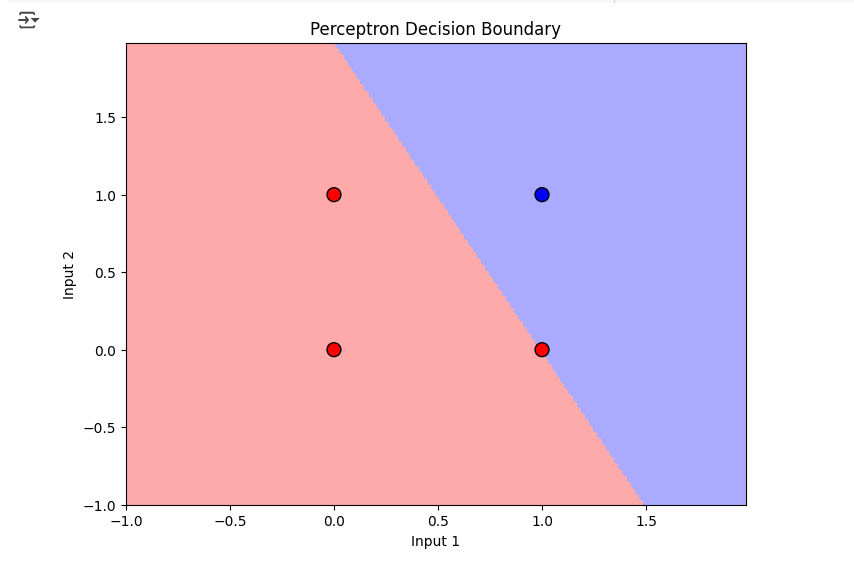게이트 결정 경계 시각화<br/>
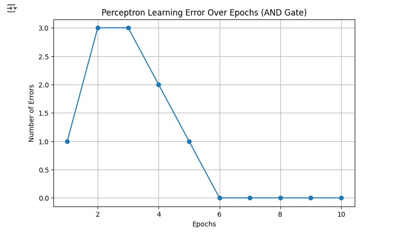오류 시각화

<br/>

**OR Gate**
>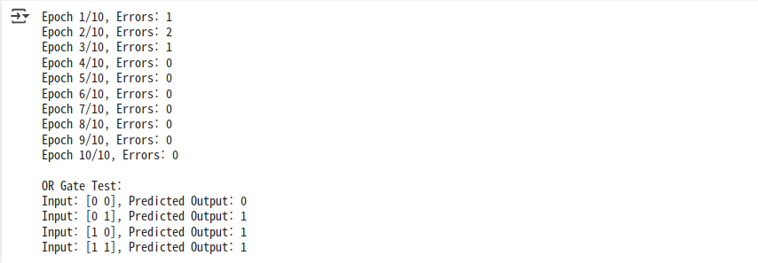예상결과<br/>
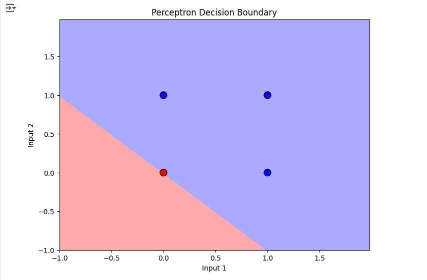게이트 결정 경계 시각화<br/>
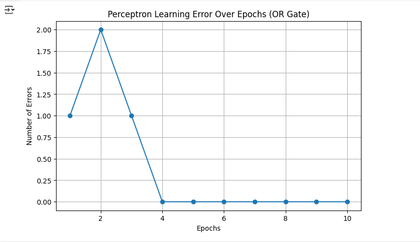오류 시각화

<br/>

**NAND Gate**
>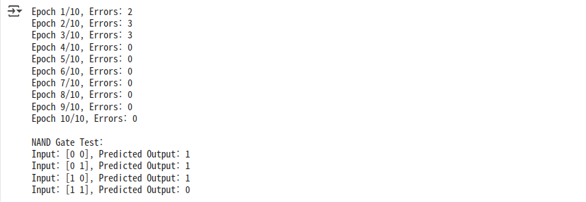예상결과<br/>
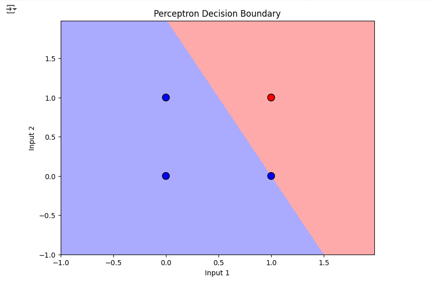게이트 결정 경계 시각화<br/>
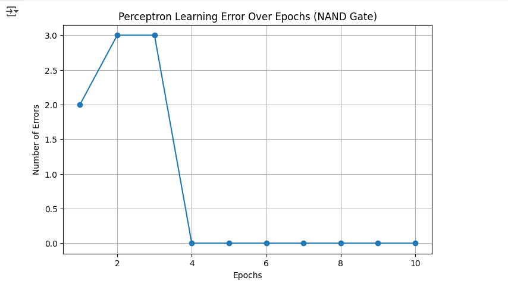오류 시각화

<br/>

**XOR Gate**
>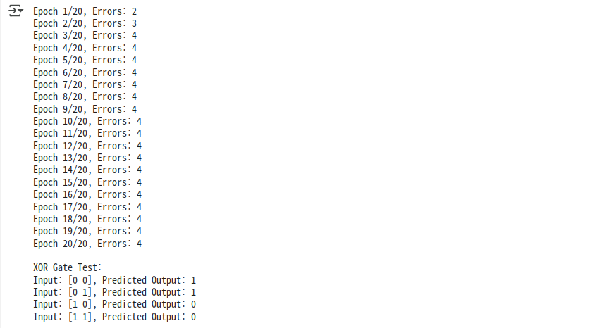예상결과<br/>
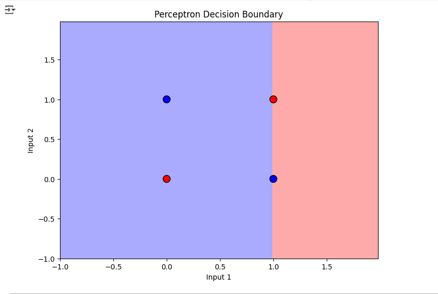게이트 결정 경계 시각화<br/>
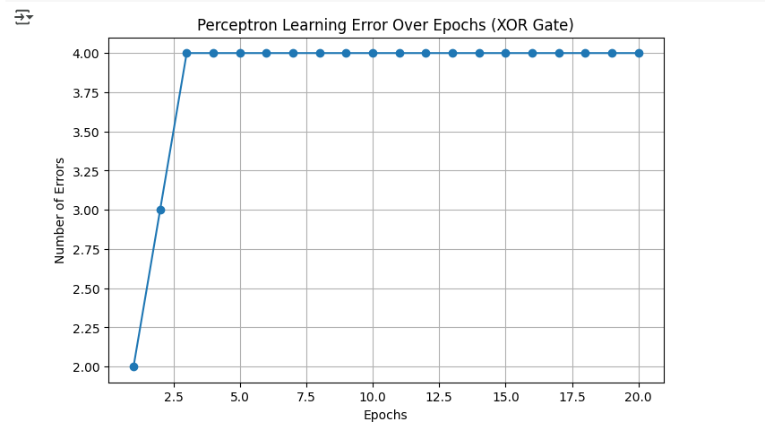오류 시각화

# 고찰
---
**XOR Gate**