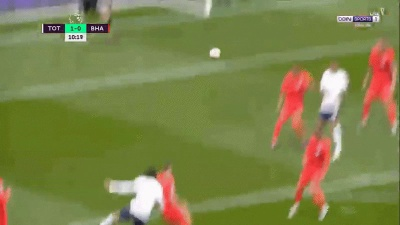

# Code
---
**비디오 파일 캡쳐**
```
import numpy as np
import cv2

# Read from the recorded video file
cap = cv2.VideoCapture("shm.mp4")

# 저장용 인덱스 초기화
save_index = 1

# 동영상 파일이 성공적으로 열렸으면 while 문 반복
while(cap.isOpened()):

    # 한 프레임을 읽어옴
    ret, frame = cap.read()

    if ret is False:
        # 한번 재생하고 스탑
      #  print("Can't receive frame (stream end?). Exiting ...")
      #  break
        # 무한 재생
        cap.set(cv2.CAP_PROP_POS_FRAMES, 0)
        continue

    # 영상 크기 resize
    frame = cv2.resize(frame, (0,0), fx=0.5, fy=0.5)

    # Display
    cv2.imshow("Frame",frame)

    # 80ms 동안 대기하며 키 입력을 받고 'q' 입력 시 종료
    # 'c' 입력 시 해당 프레임 저장
    key = cv2.waitKey(80)
    if key & 0xFF == ord('q'):
        break
    if key & 0xFF == ord('c'):
        filename = f"{save_index:03}.jpg"
        cv2.imwrite(filename,frame)
        print(f"saved:{filename}")
        save_index += 1

cap.release()
cv2.destroyAllWindows()
```
# 분석
---
**비디오 파일**
><video controls src="../../assets/img/opencv/perceptron/video/shm.mp4" title="Title"></video>

<br/>

**터미널**
>

<br/>

**캡쳐**
>001.jpg<br/>
002.jpg<br/>
003.jpg